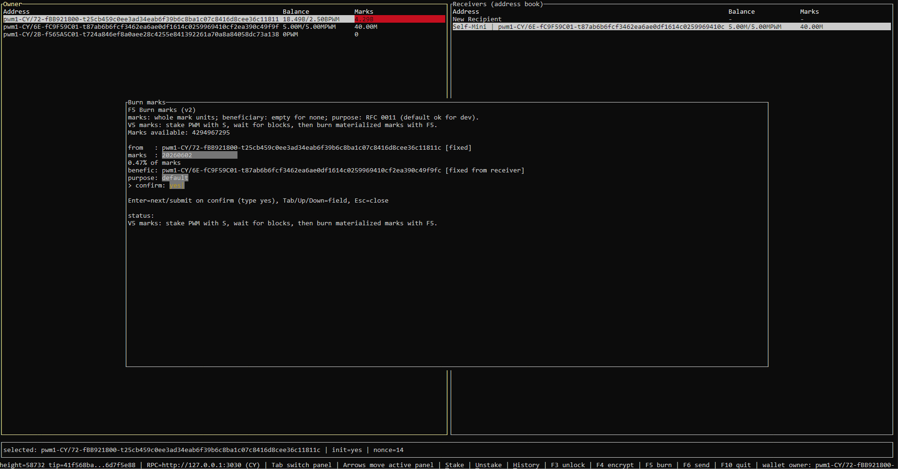

# PWM-cryptocurrency

**Languages:** English (this file) · [Русский — README-ru.md](README-ru.md)

PWM is a **native cryptocurrency using a matrixchain** model — see [MATRIXCHAIN_SPEC_v0.md](docs/MATRIXCHAIN_SPEC_v0.md) for how *matrixchain* maps to v0 (identity grid, single-chain projection, geo-shard ops). The implementation is **Rust**: PoA devnet node (`pwmd`), `pwm` CLI, `pwm-tui`, and a domain-first operator model. The project is **utility-oriented** and aimed mainly at **IT security** use cases (auditable ops, explicit trust boundaries, controllable sharding and roaming semantics), not at retail payments or generic DeFi.



**What works today (MVP-shaped):**

- **Two spec-level geo-shards** as two `pwmd` processes with different `domain_hi` (e.g. `0x10` / `0x20`), separate `--state-root`, and a **tested** happy path for peering over **real transport** with reciprocal `--transport-peer-seed` peers.
- **Same-shard** transfers and usual account lifecycle (`INIT`, `TRANSFER`, staking hooks, `BURN_MARK` where applicable) via RPC and CLI/TUI.
- **Cross-shard value move** via the explicit **EXPORT → relay/handoff → IMPORT** flow: source and target shards cooperate through configured seed trust; CLI `tx-send` / TUI and `tx-export` / `tx-import` match the [Sprint 13 as-implemented contract](docs/rfc/9-crossdomain-roaming.md). See [ROAMING-SAMPLE.md](docs/ROAMING-SAMPLE.md) and [ROAMING_COMPLETION.md](docs/ROAMING_COMPLETION.md).
- **Federated bridge trust** (including refusal and recovery paths) is part of the runtime contract; see [WHITE_SPEC_v0.md](docs/WHITE_SPEC_v0.md) §7.5 and operator notes in [pwmd.md](docs/pwmd.md).
- **Persistence:** primary path is **JsonFile** (summary `pwm-data.json`, `epochs/` JSONL, manifest; trust-default load vs audit replay). Optionally **`pwmd` can persist snapshots to ClickHouse** (cargo feature `clickhouse-snapshot`): load semantics differ from JsonFile (CH uses full replay validation today). See **Snapshot storage backends** below and [guide-node-storage-and-snapshot.md](docs/guide-node-storage-and-snapshot.md).

Relay-baseline (neutral) startup remains available for experiments; **production-style demos use explicit domain config** (`--domain-hi`, `--cluster-id`, `--node-id`).

## Storage layout

- Default `--state-root` is `state`. Effective path is chosen from runtime identity:
  - **Neutral default:** `state/neutral/<listen-addr>/pwm-data.json` (`:` → `+` in the tag).
  - **Explicit domain mode:** `state/domain-hi-0xNN/pwm-data.json`.
  - **Override:** `--data-file <ABS_PATH>` (recommended in scripts).
- Old local trees may still contain historical `state/shard-a` / `state/shard-b` from pre–domain-first builds; they are not used by current `pwmd`.
- Next to the summary file, JsonFile stores **`epochs/`** (`block_e*.json` JSONL, `pwm-epochs-manifest.json`). Startup normally trusts the checkpoint + recent tail; use `--snapshot-verify-chain` or `PWM_SNAPSHOT_VERIFY_CHAIN` for full replay audit. Details and troubleshooting: [guide-node-storage-and-snapshot.md](docs/guide-node-storage-and-snapshot.md).
- If an old flat `state/pwm-data.json` is still on disk from earlier layouts, migrate it into the namespaced path or pass `--data-file` explicitly.

## Snapshot storage backends (JsonFile vs ClickHouse)

- **JsonFile** is the default operator path: files under `--state-root`, epoch directories next to `pwm-data.json`, optional `--snapshot-verify-chain` / `PWM_SNAPSHOT_VERIFY_CHAIN` for audit.
- **ClickHouse** is an optional backend: build `pwmd` with **`--features clickhouse-snapshot`**, select the snapshot backend and HTTP endpoint via CLI / env (see `pwmd --help` and [runbook-store-snapshots.md](docs/runbook-store-snapshots.md)). Loading from CH currently stays on the **full replay** path; treat JsonFile vs CH as different operational modes until a dedicated CH trust-checkpoint contract exists ([guide-node-storage-and-snapshot.md](docs/guide-node-storage-and-snapshot.md) § ClickHouse).
- **Local testing:** running ClickHouse in **Docker Desktop** (Windows/macOS) or Docker Engine (Linux) matches how most contributors smoke-test CH — example compose: [`tools/docker/pwmd-clickhouse-compose.yaml`](tools/docker/pwmd-clickhouse-compose.yaml); schema prep and ops notes: [runbook-store-snapshots.md](docs/runbook-store-snapshots.md).

## Operator quick start (domain-first)

Supported domain semantics and labels: [DOMAINS.md](docs/DOMAINS.md).

**Single node (explicit domain):**

```powershell
cargo run -p pwmd --bin pwmd -- --listen 127.0.0.1:3030 --network-id devnet --domain-hi 0x10 --cluster-id local-cluster-a --node-id local-node-a
```

**Two shards (two terminals)** — use **different** `--listen` and **`--state-root`** per process. Ready-made scripts: `tools/demo-two-shard.ps1` (PowerShell) or `tools/demo-two-shard.sh` (bash). Minimal manual pair:

```powershell
# Shard A — domain 0x10, port 3030
cargo run -p pwmd --bin pwmd -- --listen 127.0.0.1:3030 --state-root state-a --network-id devnet --domain-hi 0x10 --cluster-id local-cluster-a --node-id local-node-a

# Shard B — domain 0x20, port 3031
cargo run -p pwmd --bin pwmd -- --listen 127.0.0.1:3031 --state-root state-b --network-id devnet --domain-hi 0x20 --cluster-id local-cluster-b --node-id local-node-b
```

**Peering (real transport + seeds)** — restart both with `--transport-real` and reciprocal `--transport-peer-seed`:

```powershell
# A seeds B
cargo run -p pwmd --bin pwmd -- --listen 127.0.0.1:3030 --state-root state-a --network-id devnet --domain-hi 0x10 --cluster-id local-cluster-a --node-id local-node-a --transport-real --transport-peer-seed 127.0.0.1:3031

# B seeds A
cargo run -p pwmd --bin pwmd -- --listen 127.0.0.1:3031 --state-root state-b --network-id devnet --domain-hi 0x20 --cluster-id local-cluster-b --node-id local-node-b --transport-real --transport-peer-seed 127.0.0.1:3030
```

**Smoke checks:**

```powershell
Invoke-RestMethod -Uri "http://127.0.0.1:3030/v1/status"
Invoke-RestMethod -Uri "http://127.0.0.1:3031/v1/status"
Invoke-RestMethod -Uri "http://127.0.0.1:3030/v1/dev/peers"
Invoke-RestMethod -Uri "http://127.0.0.1:3031/v1/dev/peers"
```

Expect `phase=ready`, peer visibility on both sides, and namespaces `domain-hi-0x10` / `domain-hi-0x20`. Point **`pwm`** / **`pwm-tui`** at the right node with `--rpc` or `PWM_RPC`; cross-shard sends and import completion are documented in [tester-guide-cli-tui-scenarios.md](docs/tester-guide-cli-tui-scenarios.md) (sections 5–9).

## Network scope and limits

- Topology is **seed-list PoA dev**: explicit seeds, not a public discovery mesh.
- **Cross-shard flows are implemented** as described above; limitations (e.g. no protocol-level **escrow on EXPORT until IMPORT finality** — design-only in RFC) are called out in [WHITE_SPEC_v0.md](docs/WHITE_SPEC_v0.md) and [rfc/9-crossdomain-roaming.md](docs/rfc/9-crossdomain-roaming.md).

## Key docs

- README (Russian): [README-ru.md](README-ru.md)
- Draft whitepaper: `DRAFT_WHITEPAPER.md`
- Whitepaper (RU): `DRAFT_WHITEPAPER-ru.md`
- Matrixchain (term vs v0 code): `docs/MATRIXCHAIN_SPEC_v0.md`
- White spec: `docs/WHITE_SPEC_v0.md`
- Geo sharding (simple): `docs/GEO-SHARDING-EXPLANATION.md`
- Cross-domain roaming runbook: `docs/ROAMING-SAMPLE.md`
- Roaming completion / stabilization notes: `docs/ROAMING_COMPLETION.md`
- MVP checklist: `docs/MVP-checklist.md`
- Dev smoke: `docs/tester-guide-devnet-smoke.md`
- Node storage and snapshot modes: `docs/guide-node-storage-and-snapshot.md`
- ClickHouse snapshot runbook: `docs/runbook-store-snapshots.md`
- CLI/TUI two-shard and cross-shard scenarios: `docs/tester-guide-cli-tui-scenarios.md`
- Domain clusters dictionary: `docs/DOMAINS.md`
- Phase 1 checklist: `docs/PHASE1_CHECKLIST.md`
- Phase 1 release summary: `docs/PHASE1_RELEASE_SUMMARY.md`
