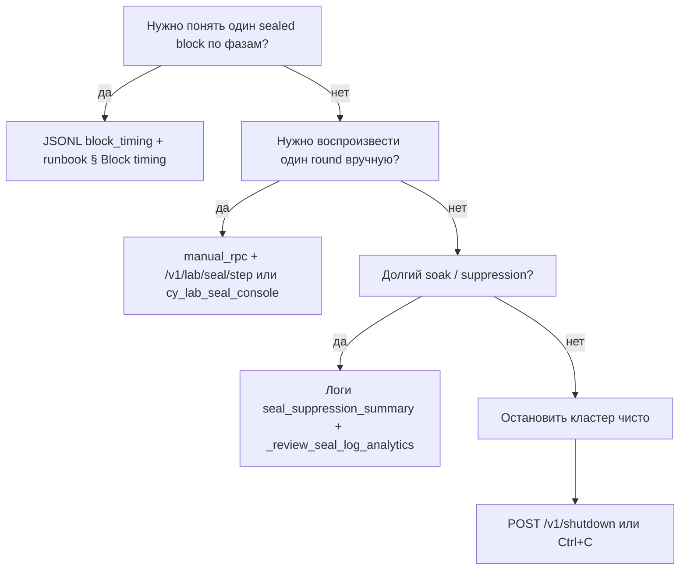

# Фичи вне плана MVP v5

Документ описывает возможности, добавленные **после заморозки scope** [MVP v5 Tokenomics Hardening](plans/mvp_v5.md): они не входят в восемь спринтов V5 (марки, инфляция, deferred activation, ClaimIPv4Batch, TUI saturation и т.д.), но нужны для **отладки CY-кластера**, расследования seal-turn и операторского closeout.

**Нормативный план V5:** [plans/mvp_v5.md](plans/mvp_v5.md), [MVP-checklist.md](MVP-checklist.md).  
**Операторские runbook’и:** [runbooks/v5-cy-cluster-precloseout-soak.md](runbooks/v5-cy-cluster-precloseout-soak.md), [runbooks/v5-cy-lab-seal-console.md](runbooks/v5-cy-lab-seal-console.md).

---

## Зачем отдельный список

Во время pre-closeout CY E2E и итеративной отладки proposer↔attester в код и скрипты добавлялись:

- наблюдаемость **одного seal-turn** (от grid-deadline до `sealed height`);
- **пошаговое** выполнение cluster seal без автоматического `seal_ahead` / gate poll;
- инструменты агентов и оператора (JSON window, аналитика логов);
- устойчивость preflight/sync и штатная остановка узлов.

Эти пункты **не меняют токеномику V5** и не обязаны быть в MVP-checklist спринтов 1–8; они помечены здесь, чтобы не путать с «плановыми» deliverable’ами.

---

## 1. Расширенное профилирование seal-turn

### 1.1 Per-block timing JSONL (`block_timing`)

**Назначение:** одна строка JSON на каждый успешно sealed блок — разложение wall-time по фазам RFC16 cluster round (propose → attest → gate → seal commit).

**Включение (CY lab):**

| Переменная | Значение по умолчанию в `cy-cluster-common.ps1` |
|------------|--------------------------------------------------|
| `PWM_BLOCK_TIMING_ENABLED` | `1` при активной отладке; может быть `false`, если включение блокирует кластер (см. комментарий в launcher) |
| `PWM_BLOCK_TIMING_PATH` | `tmp/cy-lab-block-timing.jsonl` |

**Реализация:** `crates/pwmd/src/block_timing.rs` — неблокирующая очередь событий, отложенный flush под file lock (`*.lock`, `*.pending.json`), чтобы не голодать seal loop.

**Ключевые поля записи (`schema_v=1`):**

| Поле / группа | Смысл |
|---------------|--------|
| `height`, `round`, `sealed_h` | Привязка к кластерному раунду |
| `t0_ms` | Якорь grid-deadline / открытия слота |
| `d_ms.prop_first_wire_send` | Первый wire `ClusterPropose` |
| `d_ms.att_rx_propose`, `att_proc`, `att_wire_send` | Путь attester |
| `d_ms.prop_rx_attest`, `prop_gate_ready` | Приём attest и готовность gate |
| `d_ms.prop_seal_commit` | Финальный commit блока |
| `pending_ticks_at_seal` | Сколько poll-тиков proposer ждал с прошлого seal |
| `seal_slip_ms` | Сдвиг относительно номинального grid |
| `suppress_strike`, `attest_timeout` | Контекст suppression / timeout |

**Связанные логи (stderr / `logs/.../pwmd-*.log`):** дополняют JSONL агрегатами без замены файла:

- `seal_suppression_summary` — окно 100s: slots, wait/timeout/strike, `suppression_pct`;
- `seal_cadence_drift` — наблюдаемый drift nominal vs actual (не driver cadence);
- `cluster_gate_pending_summary`, `seal_ahead_summary`;
- `cluster_attest_ready` / `cluster_attest_waiting_sync`.

**Аналитика:** `scripts/_review_seal_log_analytics.py`, `scripts/analyze_seal_suppression_overnight.ps1`, `scripts/scan_pwmd_log_counters.ps1` — CSV/SVG и счётчики по тем же маркерам.

**Отладочные отчёты:** `docs/debug/20260603-v5-cy-proposer-seal-wall-overhead.md`, `docs/debug/20260607-v5-cy-gate-poll-optimization-experiments-debug.md` и др.

### 1.2 Cluster seal observability (без JSONL)

Добавлено для RCA «почему не seal-ится» и стабильности CY:

- **Sync-ready preflight** — кворум по `live_synced_attesters`, без жёсткого gate на `sync_live.tip_h` lag (attest path readiness).
- **Continuity break fail-closed** — повторяющийся рассинхрон заголовков → разрыв peer (`sync_hdr_divergence`), а не бесконечный 50% sync.
- **Propose timeout + bounded resend** — якорь к фактическому wire-send; `cluster_gate_round_reopen` с cap (см. runbook precloseout).
- **Deadline scheduler (variant C)** — grid-aligned `next_seal_time_ms`, `poll_ms`, seal в той же итерации после `gate=OK`.
- **Heartbeat cap** на всех ролях кластера: `heartbeat_interval_ms <= seal_interval_ms`.

Подробности инвариантов — таблицы в [v5-cy-cluster-precloseout-soak.md](runbooks/v5-cy-cluster-precloseout-soak.md).

---

## 2. Пошаговая отладка cluster seal (manual RPC)

### 2.1 Режим `SealControlMode::ManualRpc`

**Проблема:** автоматический seal loop (`deadline_poll` + `seal_ahead` + частый gate poll) смешивает причины: lag sync, propose timeout и seal-ahead накладываются в одном потоке логов.

**Решение:** переключатель **auto** (как в production path) | **manual_rpc** — proposer **не** делает автоматических `seal_ahead`, `run_cluster_gate`, `chain.seal` между RPC-шагами; loop только flush block-timing (если включён) и sleep.

**Активация:**

```text
CLI:     --seal-control manual-rpc
Env:     PWM_SEAL_CONTROL=manual_rpc
Runtime: POST /v1/lab/seal/control  {"mode":"manual_rpc","verbose_default":true}
```

JSON API использует **snake_case** (`manual_rpc`, `verbose_default`). CLI-флаг остаётся `manual-rpc`.

**Ограничения (lab-only):**

- Только **cluster proposer** (или `--lab-seal-api` / `PWM_LAB_SEAL_API=1`);
- Только loopback `127.0.0.1` / `::1`;
- Attester/follower → HTTP **409**.

### 2.2 HTTP surface `/v1/lab/seal/*`

| Метод | Путь | Назначение |
|-------|------|------------|
| GET | `/v1/lab/seal/status` | `mode`, `tip_h`, `target_h`, sync-ready, lease, round, last step |
| POST | `/v1/lab/seal/control` | Переключение mode + default verbose |
| POST | `/v1/lab/seal/step` | Один шаг pipeline |

**Шаги (`step`):**

| Шаг | Действие |
|-----|----------|
| `preflight` | Подсчёт sync-ready attesters, `cluster_seal_preflight`, без мутаций |
| `lease` | Один проход lease gate |
| `propose` | Один wire `ClusterPropose` на `target_h` |
| `gate_poll` | Один `run_cluster_gate` |
| `gate_wait` | Цикл poll до ready или `timeout_ms` |
| `seal_commit` | Mempool + `chain.seal` |
| `step_all` | Цепочка preflight→…→seal_commit, стоп на первой ошибке |

С `verbose=true` в логах: префикс `manual_seal step=… target_h=… phase=… elapsed_ms=…` (target `pwmd::operator`).

**Код:** `crates/pwmd/src/api/handlers_lab_seal.rs`, состояние `SealManualState` в `state.rs`.

**Типичный сценарий оператора:**

1. Поднять attester, затем proposer (`manual-rpc` или switch после старта).
2. Выровнять chain (restart / snapshot / `-CleanState` при fork).
3. `preflight` → `propose` → `gate_wait` → `seal_commit` с tail логов обеих нод.
4. `control` `mode=auto` — вернуть soak без рестарта.

---

## 3. CY lab seal console (единое JSON-окно)

**Назначение:** одна команда = HTTP-ответ proposer + структурированные события из логов **proposer и attester** за тот же интервал wall-time (byte-offset window, не полный файл).

**Скрипт:** `scripts/cy_lab_seal_console.py` (stdlib, Python 3.10+).

```powershell
python scripts/cy_lab_seal_console.py discover
python scripts/cy_lab_seal_console.py step preflight --verbose
python scripts/cy_lab_seal_console.py watch --interval-ms 500 --max-ticks 120
```

**Схема ответа:** `ok`, `cmd`, `rpc`, `rpc_meta`, `window.proposer` / `window.attester` (`events[]` с `kind`: `manual_seal`, `cluster_attest`, `sealed`, …), `summary`, `warnings`.

**Состояние курсора:** `tmp/cy-lab-seal-console.state.json` (опционально).

**Тесты:** `scripts/_test_cy_lab_seal_console.py`.

**Runbook:** [runbooks/v5-cy-lab-seal-console.md](runbooks/v5-cy-lab-seal-console.md).

Удобно для **агентов** (MCP/оркестратор) и для корреляции шага RPC с двумя логами без ручного grep.

---

## 4. Штатная остановка узла (graceful shutdown)

**Назначение:** предсказуемый stop при Ctrl+C, `SIGTERM` (Unix) и `POST /v1/shutdown` — один путь `graceful_shutdown_request`, без «обрыва» transport/seal без записи в лог.

**Операторская строка (RU):**

```text
#INFO: pwmd остановлено оператором reason=<rpc|SIGINT|SIGTERM|debug_stop> node_id=<id>
```

**Порядок:** dedup guard → snapshot `ShutdownFull` → останов peer/loops → `shutdown_tx` → axum graceful shutdown.

**Код:** `handlers_shutdown.rs`, `spawn_shutdown_signal_task` в `lifecycle.rs`.

При manual_rpc mid-gate поведение abort in-flight round — best-effort; см. [review 20260531](reviews/20260531-v5-cy-lab-seal-manual-console-shutdown-review.md).

---

## 5. Вспомогательная инфраструктура отладки

| Артефакт | Назначение |
|----------|------------|
| `scripts/devnet_state_backup.ps1` | Бэкап state CY перед экспериментами |
| `scripts/_devnet_clean_state.ps1` | Архив + очистка `tmp/state-cy-*` |
| `scripts/cy_cluster_two_node_smoke.ps1` | Расширенный smoke / soak harness |
| `cy-cluster-*.ps1` | Прямой запуск `pwmd.exe` из `rust-target-shared/debug` при наличии бинарника |
| `docs/debug/*` | Root-cause отчёты (attest gap, wall overhead, gate poll, queue vs bridge) |
| `.cqds/team-tasks/` | Очередь VS Code coding worker (`project_id=5`) |

---

## 6. Соответствие тикетам и коммитам (ориентир)

| Область | Примеры task id | Git (ориентир) |
|---------|-----------------|----------------|
| Block timing JSONL | debug / precloseout soak | `5aa486c`, `15dc884` |
| Manual RPC + console + shutdown | `20260610-v5-lab-cluster-seal-manual-rpc-stepmode-coding`, `20260611-v5-lab-seal-console-*`, `20260611-v5-pwmd-graceful-node-shutdown-*` | `f058b61`, `4cc7db8`, `f7f4935` |
| Preflight / continuity | `20260610-v5-attester-sync-fork-*` (in progress) | `68044ca`, `e845853` |
| Review сводный | — | [20260531-v5-cy-lab-seal-manual-console-shutdown-review.md](reviews/20260531-v5-cy-lab-seal-manual-console-shutdown-review.md) |

---

## 7. Целостность snapshot ↔ genesis (ADR 0008)

**Проблема:** при trust-default load можно было подменить checkpoint в `pwm-data.json` / epochs, не меняя `--genesis-file`, и нода продолжала бы seal.

**Решение (принято, реализация в работе):** [adr/0008-snapshot-genesis-anchor-light.md](adr/0008-snapshot-genesis-anchor-light.md)

- Лёгкие проверки без full replay по умолчанию.
- Поля `genesis_anchor`: commitments + **одна** подпись валидатора (защита от дурака / ИИ-правок).
- Preflight **block@1** как референс для prune: без height=1 на диске trust load отказывает.
- Миграция старых snapshot без anchor (migrate-on-load + warn).

Тикет: `tasks/20260612-v5-snapshot-genesis-anchor-light-coding.json`.

**Bootstrap / pruned distribution (будущее):** те же дайджесты + k-of-n подписи активных validators шарда — [rfc/20-bootstrap-snapshot-pruned-distribution.md](rfc/20-bootstrap-snapshot-pruned-distribution.md), [adr/0004-cleanup-chain-bootstrap-snapshot-and-anchoring.md](adr/0004-cleanup-chain-bootstrap-snapshot-and-anchoring.md) (обновлён § связь с 0008).

---

## 8. Что сознательно не входит сюда

- **Токеномика V5** (lazy marks, float inflation, ClaimIPv4Batch, deferred policies) — только [plans/mvp_v5.md](plans/mvp_v5.md).
- **Публичный production API** без lab guard для manual seal.
- **TUI-панель** step-mode (v1 — только RPC + Python console).
- **Полный MCP-сервер** для seal console (phase 2: возможен thin stdio shim; сейчас CLI + JSON stdout).

---

## 9. Быстрый выбор инструмента



---

*Последнее обновление документа: 2026-05-31 (после закрытия lab slice manual RPC + console + shutdown).*
