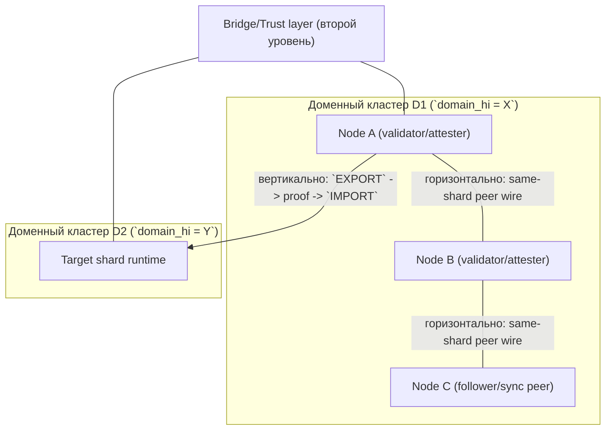

# PWM White-spec v0 (MVP)

Статус: черновик реализации, согласован с [DRAFT_WHITEPAPER-ru.md](../DRAFT_WHITEPAPER-ru.md) с явными упрощениями.

Смысл термина **matrixchain** в README и сопоставление с whitepaper (оси «идентичность / исполнение / экономика»): [MATRIXCHAIN_SPEC_v0.md](MATRIXCHAIN_SPEC_v0.md).

План следующей фазы по адресам и witness-модели: [ADDRESS_SPEC_PHASE1_bech32dx.md](ADDRESS_SPEC_PHASE1_bech32dx.md).

## 1. Цели v0

- Один процесс-цепочка (devnet), классические подписи (Ed25519).
- Кластерная идентификация счёта через **brute-HD** по 16-битному коду домена.
- Транзакции: `INIT`, `TRANSFER`, `STAKE`, `UNSTAKE`, `BURN_MARK`.
- Марки и стейкинг в **упрощённой** форме (см. §6–7).
- IPv4-клайминг, инфляция, PQC, шардинг, арбитры, полный набор «глупых контрактов» — **вне v0** (зарезервированы в протоколе как расширения).

## 2. Идентификаторы

### 2.1 Код домена

`domain_code: u16` — 16-битный код домена (как в whitepaper **AABB**), используемый в модели:

- `0x0300..=0xC5FF` — regulatory/country (195 country-кластеров; основной пользовательский диапазон),
- `0x0000..=0x02FF` — reserved prelude (первые 3 `domain_hi`, не назначаются странам в текущем индексе),
- `0xD000..=0xDFFF` — sector (11 индексированных sector-кластеров внутри класса),
- `0xE000..=0xEFFF` — reserve (нельзя как recipient в regular tx),
- `0xF000..=0xFFFF` — witness (служебные witness-only адреса, без приёма обычных переводов).

### 2.2 Кластерный адрес (бинарный)

Для индекса деривации `i` (несекретный счётчик перебора):

1. Дочерний ключ: `sk_i = HD_derive(master_sk, path m/0'/i)` (SLIP-0010 Ed25519).
2. `pk_i` — публичный ключ.
3. `addr_raw = BLAKE3(pk_i || LE_U32(i))` (32 байта).
4. Условие совпадения: `u16_be(addr_raw[0..2]) == domain_code`.

Первое подходящее `i` фиксируется вместе с `pk_i` как активный ключ счёта.

Человекочитаемые формы в Phase 1:

- primary UX (strict pretty): `pwm1-<label_or_$hex!>-f<flags8hex>-t<tail52hex>`,
- canonical bech32DX: `pwm1...` (поддерживается для ввода/вывода и round-trip),
- legacy `PWMv0-<HEX64_ACCOUNT_ID>` / plain hex: только compat-ввод.

**AccountId** в состоянии: `addr_raw` (32 байта).

### 2.3 Инициализация счёта (INIT)

До включения `INIT` счёт **неактивен**: входящие переводы отклоняются (кроме специального правила devnet не используется — всегда INIT первым после funding из genesis недоступен; в v0 **genesis может назначать прединициализированные счета валидаторов**).

Поля `INIT` (MVP):

| Поле        | Тип      | Описание                          |
|------------|----------|-----------------------------------|
| `index`    | `u32`    | индекс/ZIP/TNK id (метаданные)    |
| `flags`    | `u32`    | битовая маска поведения (резерв)  |

После `INIT` счёт активен; `index` и `flags` хранятся в состоянии.

**V4 compatibility gap:** текущий v0 `INIT` не несёт corporate metadata и не различает root/generic registration внутри corporate-sector cluster. В V4 Policy Engine Runtime ожидается расширение `INIT`, которое сможет регистрировать компанию в `domain_lo = 0` без аренды собственного домена, а также задавать ограниченную policy posture, включая основу для аварийной маршрутизации. До появления отдельного RFC/ADR эти поля не являются частью v0 wire/state contract.

## 3. Транзакции (тело + подпись)

Каноническое сериализованное тело (без подписи) хэшируется: `tx_hash = BLAKE3(canonical_body)`.

**Реализация v0 (`pwm-core`):** вместо отдельной serde-сериализации «только тело» используется сообщение `signing_message(tx)` = префикс `PWMv0/TX` + bincode полей, по которому считается хэш для подписи и проверки. Семантически это один согласованный канон для узла и CLI; при смене формата нужно обновить и код, и этот абзац.

Подпись: Ed25519 по `tx_hash` ключом отправителя (для `INIT` — дополнительно требуется подпись владельца кластера = тот же ключ в v0).

Типы:

### 3.1 `INIT { index, flags }`

- Отправитель: неактивный счёт с нулевым или genesis-выданным балансом **не** требуется; в v0 достаточно: счёт существует как пара ключей, публикует INIT один раз.
- Эффект: `initialized = true`, сохранить `index`, `flags`.

### 3.2 `TRANSFER { to: AccountId, amount: u128, fee: u128 }`

- Только для активных счетов.
- `from.balance >= amount + fee`, `fee` сжигается на комиссию сети (начисляется `fee_pool` валидаторам в v0 упрощённо — зачисление в пул блока).
- Recipient policy в regular user-flow: домены `reserve`/`witness` и неизвестные/неиндексируемые значения отклоняются.

### 3.3 `STAKE { amount: u128 }` / `UNSTAKE { amount: u128 }`

- Перевод между `balance` и `staked` при активном счёте.
- В v0 без периода разблокировки.
- `staked` не является переводимым балансом: прямой `TRANSFER` застейканных монет не допускается; любые движения stake выполняются только через `STAKE`/`UNSTAKE` (и последующие stake-governance расширения).

### 3.4 `BURN_MARK { mark_amount: u32, beneficiary: AccountId | NONE }`

- Списывает марки с баланса отправителя; `mark_amount` уничтожается.
- `beneficiary` в бинарном формате: либо 32 байта account, либо нулевой идентификатор для «безадресной аннигиляции» (резерв поля).
- Для `beneficiary` применяется та же recipient policy (без `reserve`/`witness`/unknown в regular flow).

Примечание по эволюции:

- Для v0 devnet источник burn — поле `marks` аккаунта.
- Для v1 testnet baseline (см. §7) источник burn переопределяется на `marks_quota` (burn-only ресурс), чтобы сохранить strict-upgrade по форме tx при упрощённой marks-экономике.

## 3.5 Wallet-first tx path (CLI/TUI)

- В Phase 1 путь подписи по умолчанию — `--wallet` (wallet-first); `--master` остаётся как явный dev-override.
- Wallet v1 по умолчанию encrypted; plaintext допустим только как `INSECURE_DEV_ONLY` при явном opt-in.

## 4. Состояние счёта

```text
struct Account {
  balance_pwm: u128,
  staked: u128,
  marks: u32,
  initialized: bool,
  index: u32,
  flags: u32,
}
```

## 5. Эмиссия и марки (упрощение v0)

- **Инфляция / IPv4-клайминг**: не реализуются; награда за блок фиксирована константой `BLOCK_REWARD` из genesis, начисляется `producer` из заголовка блока.
- **Марки от стейка**: за каждый применённый блок к каждому активному счёту:

`marks_accrued = staked * MARKS_PER_BLOCK_COEFF / 1_000_000` (целочисленно, коэффициент из genesis).

- **Накопление марок**: индивидуальный TTL и периодический `prune` для марок не являются целевой моделью. Актуальное направление V5 — ленивое начисление до фиксированного потолка баланса без `marks_expiry_block` и TTL-buckets.

## 6. Консенсус devnet (v0)

Round-robin **PoA**: фиксированный список валидаторов (Ed25519 pubkeys) в genesis; блок подписывает текущий лидер; высота определяет индекс лидера `height % N`.

Заголовок блока: `height`, `prev_hash`, `timestamp`, `producer_idx`, `tx_root`, `state_root`, `signature`.

## 7. v1 testnet extension (strict-upgrade над v0)

Этот раздел фиксирует эволюционный переход от текущего devnet к более зрелому testnet без смены базовой модели состояния.

### 7.1 Базовая совместимость

- `v1` сохраняет account-based состояние (`balance/staked/marks/initialized/index/flags`) как источник истины.
- Существующие v0 tx-типы (`INIT`, `TRANSFER`, `STAKE`, `UNSTAKE`, `BURN_MARK`) сохраняют форму и локальный (same-shard) путь.
- Для `BURN_MARK` в v1 baseline применяется явно оговоренный economic-toggle: burn списывает `marks_quota` (не `marks`), при неизменной tx-форме и policy-контуре.
- Кошелёк/подпись/канонизация тела tx остаются совместимыми с v0; новые поля/типы добавляются только как расширение.

### 7.2 Минимальный scope v1 testnet

- Минимум два независимых **spec-level geo-shard** (доменных кластера) с отдельным state и validator set.
- **Нормативное определение spec-level geo-shard:** шард в спецификационном смысле - это кластер адресов с фиксированным `domain_hi` (старший байт `domain_code`), а не диапазон `domain_hi`.
- Допускается "островизация" на уровне доменного кластера: отдельные `domain_hi` кластеры могут временно быть изолированы/ограничены политиками и инфраструктурой, без изменения этого определения.
- Названия `Shard A`/`Shard B` в операционных dev/test сценариях используются только как удобные метки экземпляров процесса и не заменяют протокольную гео-шард семантику.
- **Критически важно:** эвристика диапазонного деления вида `domain_hi < 0x80` vs `>= 0x80` (так называемый `0x80 split`) запрещена как источник протокольного маршрута.
- Межшардовый перевод монет реализуется через явный additive flow:
  1. `EXPORT` в source-shard,
  2. finality-proof (минимальный профиль сертификата),
  3. `IMPORT` в target-shard,
  4. replay-защита (`ImportedSet` или эквивалентная структура used-export identifiers).
- Выбор same-shard vs cross-shard выполняется протокольно по сравнению `domain_hi(sender)` и `domain_hi(receiver)`:
  - если равны -> локальный путь (`TRANSFER`);
  - если различаются -> обязателен путь `EXPORT/IMPORT`.

#### 7.2.a Горизонтальные и вертикальные связи (нормативно)



- **Горизонтальные связи** (`domain_hi` одинаковый): это внутридоменный peer/wire контур одного geo-shard (включая attestation/quorum-подгруппы и sync/follower peers; см. [RFC 16](rfc/16-validator-clone-attestation.md), [RFC 8](rfc/8-shard-runtime-identity-and-peering.md)).
- **Вертикальные связи** (`domain_hi` различается): это только межшардовый путь `EXPORT`/`IMPORT` и связанный bridge/trust слой второго уровня; такие связи не трактуются как "same-shard P2P".
- **Норма включения:** сетевые кластеры (операционные подгруппы узлов внутри одной шардовой идентичности, включая RFC16 cluster attest) могут входить в состав доменного кластера с фиксированным `domain_hi`.
- **Норма невложенности и границы:** обратная вложенность не предусмотрена — доменный кластер не вложен в сетевой, а сетевой кластер не задаёт протокольную границу шарда; граница задаётся доменом/`domain_hi` и маршрутизацией этого white-spec.

### 7.3 Политики и финализация в v1

- Для MVP v1 обязательны минимальные policy-checks recipient/domain класса (reject `reserve`/`witness`/unknown в regular flow).
- Продвинутые правила (cosign matrix, membership-driven routing, admission governance) остаются расширением и подключаются без слома базового потока.
- Операционная модель shard runtime identity (cluster-bound launch params, node self-identification в p2p, native/foreign peer-priority) формализована отдельно в `docs/rfc/8-shard-runtime-identity-and-peering.md`; этот слой не меняет базовую протокольную семантику маршрутизации из данного white-spec.
- Finality-сертификат для v1 допускает минимальный testnet-профиль, но формат должен быть расширяемым для более строгих моделей.
- Для v1 testnet без secondary mark-балансов вводится `marks_quota` (burn-only ресурс аккаунта):
  - `BURN_MARK` списывает `marks_quota`, а не `balance_pwm`;
  - в baseline допускается `fee = 0` для mark-based операций и cross-shard burn контекста.
- Междоменный контекст `BURN_MARK` не требует специальной обработки в target-shard:
  - доказательство burn формируется и верифицируется только в source-shard;
  - target-shard не обязан менять локальное состояние marks по чужому burn-событию.
- Для `IMPORT` в v2-extension вводится минимальная комиссия `min_import_fee = 0.01 PWM`:
  - проверка выполняется на target-shard до apply;
  - при успешном apply комиссия зачисляется в `fee_pool` target-шарда (variant B);
  - при reject `IMPORT` комиссия не списывается.

### 7.4 MVP-срез Sprint 13 по междоменному роумингу (как реализовано)

Реализованный baseline (Sprint 13):
- Междоменный путь для перевода стоимости работает как явный операторский поток `EXPORT -> IMPORT`.
- `EXPORT` фиксирует детерминированное происхождение (`export_id` + `to/amount/target_domain`) в runtime source-домена.
- `IMPORT` принимается только при наличии известного совпадающего provenance и одноразовой replay-защиты (`ImportedSet`).
- RPC/runtime-контракт для MVP стабилен: `POST /v1/tx` возвращает `204` при успехе, `409` для дублирующегося import, `400` для невалидного/неизвестного provenance.
- `POST /v1/export-provenance` (`handoff_register`) используется как transport/pending-канал и **не** мутирует replay-critical `State.exported_registry`.
- Детерминированный target-path в MVP: provenance входит в `Import`, а replay-critical обновления (`exported_registry`, `imported_set`) происходят в block-apply path.
- Практический runbook для оператора: [ROAMING-SAMPLE.md](ROAMING-SAMPLE.md).
- Простое пояснение модели sharding/roaming: [GEO-SHARDING-EXPLANATION.md](GEO-SHARDING-EXPLANATION.md).

Не покрыто в этом MVP-срезе (намеренно):
- Нет слоя admission/compliance-сертификатов.
- Нет продвинутых профилей finality сверх минимального baseline testnet.
- Нет async-оптимизации pipeline для HTTP-ingest (`apply_tx + seal([])` остаётся синхронным для `EXPORT/IMPORT`).
- Нет выделенной settlement/import-export chain (это следующий архитектурный этап, не текущий MVP gate).
- Нет протокольной **блокировки** стоимости на source до финализации `IMPORT` (модель «lock / conditional finalize / timeout-refund»). Текущий baseline: `EXPORT` списывает spendable-стоимость и фиксирует provenance; приём `IMPORT` на target валидируется по известному provenance и replay-guard, **без** сквозного гейта «источник ждёт целевой finality proof». Возможное направление пост-MVP зафиксировано в [rfc/9-crossdomain-roaming.md](rfc/9-crossdomain-roaming.md) Appendix A.5 (только дизайн, имплементация отложена до отдельной спеки).

Известные узкие места / хрупкость (контролировать):
- Операторский/сетевой handoff: transport-слой может давать частично доставленные batches; важна наблюдаемость счётчиков backfill.
- Семантика retry: повторные операторские ретраи могут создавать попытки duplicate-import (`409` ожидаем); tooling должен трактовать это как идемпотентный reject, а не как "неизвестный сбой".
- Синхронный hot path seal: `apply_tx + seal([])` в request-path повышает latency/нагрузку на конкуренцию при всплесках.
- Риски таргетинга: путаница в `target_domain`/RPC-endpoint ведёт к детерминированному reject (`400 invalid import`), но всё равно вызывает операторскую путаницу в multi-node сценариях.
- Восстановление после cleanup/rollback теперь опирается на trust-gated auto-backfill; peer trust gate (`network_id`/`genesis_hash`) обязателен.

Развилки решений (варианты после MVP):
- A) Вынести sealing `EXPORT/IMPORT` из синхронного HTTP-path (очередь + async worker). Компромисс: лучше латентность, но сложнее семантика статуса/finality.
- B) Усилить trust/backfill контракт (расширенные политики доверия, richer proof bundle, операционные SLO).
- C) Ввести слой admission/policy-сертификатов. Компромисс: сильнее governance/compliance, но больше протокольная и операционная поверхность.
- D) Вынести кросс-шард факты в dedicated settlement/import-export chain (next-stage).
- E) Source-side lock/escrow на `EXPORT` до доказуемой финализации `IMPORT` (или таймаута) — см. [rfc/9-crossdomain-roaming.md](rfc/9-crossdomain-roaming.md) Appendix A.5; не начинать код до согласованного proof-интерфейса и политики refund.

### 7.5 Мостовой слой доверия (второй уровень) и отказ в федеративном доверии

**Два уровня «бухгалтерии» (нормативно развести):**

1. **Первый уровень** — локальное состояние шарда: эмиссия, сжигания, same-shard переводы. Между шардами **не** требуется совпадение суммарных балансов или денежной массы: они закономерно расходятся.
2. **Второй уровень** — учёт **только межшардовых перемещений стоимости** (факты `EXPORT`/`IMPORT`, consumed-import множество, согласованные идентификаторы `export_id` и поля provenance). Именно этот слой задаёт **федеративную согласованность** «кто что перевёл между шардами», а не сырой баланс аккаунта на произвольной высоте.

**Отказ в доверии (bridge trust refusal):** если нода обнаруживает **расхождение представлений о втором уровне** относительно согласованного доверенного якоря (например: несовпадение мостового коммитмента с **репликой того же `domain_hi`** при том же сетевом trust gate; **не** требуется совпадение дайджеста с пиром **другого** шарда — см. Appendix A.6; или расхождение между репликами одного шарда на одной высоте по производному мостовому снимку — точное определение коммитмента см. [rfc/9-crossdomain-roaming.md](rfc/9-crossdomain-roaming.md) Appendix A.6), она **не продолжает** выдавать клиентам правдоподобный федеративный UX. Это включает сценарии подставы/партиции/репликационного рассинхрона и направленных атак на наблюдаемость чужого шарда.

**Закрытие сервиса одного окна (one-window):** при активном **отказе в доверии по мосту** клиентский контур «одного окна» (домашний RPC + intent + наблюдение/баланс за **чужим** шардом через ту же ноду) **закрывается**: не отдавать состояние балансов и не давать «нюхать» срез пострадавшей или недостоверной стороны так, как при здоровой федерации. Допустимы только безопасные ответы об отказе, диагностика для оператора и путь восстановления доверия (repair/backfill по политике), но не подмена согласованности «по умолчанию».

**Консенсус:** локальный консенсус по цепочке внутри шарда не отменяется этим пунктом автоматически; меняется **декларируемая готовность** федеративного слоя и UX-доверие к межшардовому отображению. Детали контракта API и флагов readiness — эволюция реализации; нормативная цель зафиксирована здесь и в RFC 0009 Appendix A.6.

## 8. Вне скоупа v1 testnet (для спецификации позже)

- Политики «глупых контрактов», корпоративные двойные подписи, CLTV.
- Арбитр зоны, реверсы.
- Региональный консенсус-шардинг.
- PQC, отдельный формат адреса whitepaper vs `PWMv0-`.
- Оффчейн-сжигание продакшн и X-PWM — см. модуль заглушки и [OFFCHAIN_STUB.md](./OFFCHAIN_STUB.md).

## 9. Расширение v2: единые марки и auto-claim materialization

Этот раздел фиксирует v2-дизайн как расширение поверх текущего baseline без немедленного переписывания всего runtime.

### 9.1 Единый марочный баланс

- Целевой продуктовый контракт v2: один пользовательский баланс марок `marks`.
- Исторический `marks_quota` трактуется как legacy-переходный слой и подлежит сворачиванию в единый `marks` в кодовой миграции.
- `BURN_MARK` в целевой модели v2 списывает `marks` (не отдельную burn-only квоту).

### 9.2 Расширение `BURN_MARK` полем purpose

- `BURN_MARK` расширяется обязательным текстовым полем `purpose`.
- Нормативный лимит: `1..80` UTF-8 байт после детерминированной нормализации (`trim` по краям, без Unicode composition transforms).
- Control-символы C0/C1 запрещены.
- Рекомендуемый privacy-паттерн: salted hash внешнего идентификатора вместо открытого PII.

### 9.3 Maturity и explicit/auto claim

- Материализация марок выполняется двумя путями:
  - explicit через `ClaimTx`,
  - auto-claim как неявный state-эффект релевантной stake-management транзакции.
- Релевантный баланс для maturity: `staked_pwm_units`.
- Любое ненулевое изменение релевантного баланса сбрасывает непрерывность maturity.
- Базовая норма созревания: `1 PWM = 1 hour` (эквивалентно `3600` блокам при `BLOCK_TIME_SEC = 1`).
- Округление materialized дельты: `floor` (дробный remainder не переносится как отдельный state-credit).
- Формула materialization: `hours = floor(delta_seconds / 3600)`, `whole_pwm_staked = floor(staked_raw / 1_000_000)`, `matured_units = whole_pwm_staked * hours`.
- Нормативный смысл: `1 whole PWM staked for 1 hour = 1 mark`.
- Auto-claim выполняется только при `matured_units > 0`; при нулевой дельте релевантная транзакция продолжает выполняться без claim-эффекта.
- Получение эмиссии монет и materialization марок в v2 привязано к stake-контуру (`STAKE`/`UNSTAKE` lifecycle); пассивный liquid-баланс без stake не формирует maturity-поток.

### 9.4 Free-claim/day и chain-time

- Ограничение «одна free claim-транзакция в сутки» применяется к explicit `ClaimTx`.
- `utc_day` считается только от chain time: `floor(block_unix_time_utc / 86400)`.
- Auto-claim не является отдельной claim-транзакцией и не потребляет free-slot.
- Paid fallback для explicit claim сохраняется.

### 9.5 Нормативные ссылки пакета RFC v2

- [rfc/11-burn-purpose-and-claim-tx.md](./rfc/11-burn-purpose-and-claim-tx.md)
- [rfc/12-claim-maturity-and-state-model.md](./rfc/12-claim-maturity-and-state-model.md)
- [rfc/13-claim-policy-matrix.md](./rfc/13-claim-policy-matrix.md)
- [rfc/14-claim-burn-api-error-contract.md](./rfc/14-claim-burn-api-error-contract.md)
