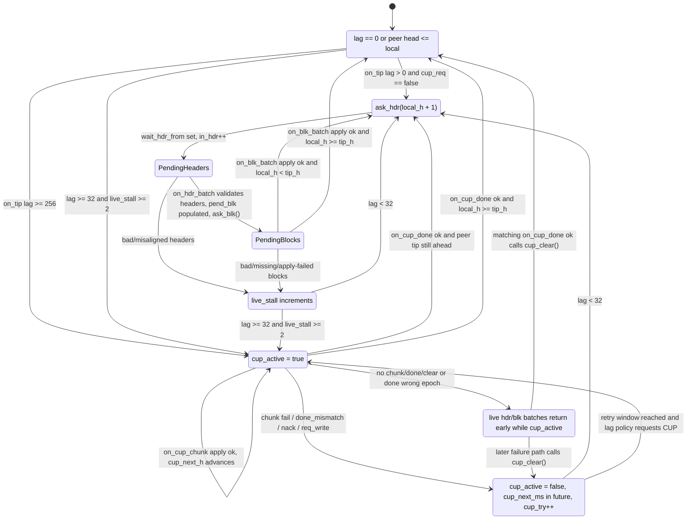

# RCA: peer sync mode zones and short-tail CUP stickiness

Кратко для оператора: `lag < 32` сейчас запрещает только новый старт epoch CUP из `live_stall`; он не выключает уже активный CUP, не очищает очереди live hdr/blk и не является явным состоянием "sync off". Поэтому консольные `Sync progress 99/100%` могут выглядеть как "синк не выключился", хотя это либо live short-tail по одному блоку, либо CUP/очереди без операторски видимого FSM-лога.

## Scope and evidence

- Code inspected: `crates/pwmd/src/transport/peer_session/sync_live.rs`, especially `on_tip`, `maybe_start_cup`, `send_cup_req`, `on_hdr_batch`, `on_blk_batch`, `on_cup_chunk`, `on_cup_done`, `cup_clear`, `on_nack`.
- State inspected: `crates/pwmd/src/transport/handshake_state.rs` `SyncPeerState`.
- Runtime evidence sampled from active CY terminals: attester console repeatedly prints `Sync progress 99% rem=1 ...` followed by `Sync progress 100% rem=0 ...` while `goal` advances by small deltas and standby disk checkpoints happen every 10 heights. Those lines do not expose whether the transport branch is live hdr/blk or CUP.
- No temporary tracing or debug assertions were added.

## State diagram



ASCII summary:

```text
tip-aligned
  | lag > 0
  v
live short-tail -> wait_hdr/pend_blk/wait_blk -> apply ok -> tip-aligned or continue live
  | bad hdr/blk/apply/nack increments live_stall
  v
live_stall
  | lag < 32: stay live
  | lag >= 32 and live_stall >= 2, or lag >= 256
  v
epoch CUP (cup_active)
  | chunks apply
  | done ok -> clear CUP -> live if still behind
  | fail/nack/done_mismatch -> clear CUP + backoff
  | no done / wrong done epoch / no clear -> live batches are ignored
```

## Mode table

| Mode | Entry condition | Exit / auto-disable condition | Blocks |
|---|---|---|---|
| Idle / tip-aligned | `on_tip` sees `head_h <= local_h`, or `lag == 0` after divergence checks. | Next peer tip with `head_h > local_h`. There is no persisted "sync off" bit; this is inferred per tip event. | Nothing directly. |
| Live short-tail hdr/batch pipeline | `lag > 0` and `cup_req == false`, or CUP request is skipped and code falls through to `ask_hdr(local_h + 1)`. With current constants this is the intended path for `lag < 32` unless `cup_active` is already true. | Successful `on_blk_batch` applies blocks, resets `live_stall = 0`, logs progress, then requests more blocks only if queues remain. Once local reaches peer `tip_h`, later `on_tip` is idle. | `ask_hdr` is capped by `in_hdr < SYNC_INF_CAP`; `ask_blk` is capped by `in_blk < SYNC_INF_CAP` and refuses to send when `wait_blk` is non-empty. |
| Pending header queue | `ask_hdr` sets `wait_hdr_from`, `wait_hdr_lim`, increments `in_hdr`. | `on_hdr_batch` decrements `in_hdr`, takes `wait_hdr_from`, validates continuity, populates `pend_blk`, optionally chains another header request. | If `cup_active` is true, `on_hdr_batch` returns before decrementing `in_hdr` or clearing `wait_hdr_from`; live responses are ignored. |
| Pending block queues | `on_hdr_batch` pushes `(height, hash)` into `pend_blk`; `ask_blk` moves rows to `wait_blk` and increments `in_blk`. | `on_blk_batch` decrements `in_blk`, takes `wait_blk`, applies blocks, requeues unused rows, then calls `ask_blk` again. | If `cup_active` is true, `on_blk_batch` returns before decrementing `in_blk` or taking `wait_blk`; live block responses are ignored. |
| `live_stall` pressure | Header continuity rejection, `exp_h != local_h + 1`, block mismatch/missing block, apply failure, NACK, CUP write/chunk/done failure. | Reset to `0` only on live apply success, CUP chunk success, or CUP done success. There is no age decay. | Contributes to CUP entry only when `lag >= SYNC_CUP_SHORT_TAIL_MAX` and `live_stall >= 2`; below 32 it should not start a new CUP by itself. |
| Epoch CUP (`cup_active`) | `send_cup_req` sets `cup_active = true`, epoch/range/next fields and `cup_target_h`. `maybe_start_cup` is called when `cup_req` is true. | `cup_clear` in request write failure, chunk failure, `on_cup_done` success, `done_mismatch`, or active CUP NACK. On done success, `cup_try = 0` and `live_stall = 0`. | Blocks live batch application: `on_hdr_batch` and `on_blk_batch` early-return while `cup_active`. `on_tip` also returns early when `maybe_start_cup` returns true. |
| `cup_try` / backoff | CUP write failure, chunk failure, `done_mismatch`, active CUP NACK. `cup_next_ms = now + cup_backoff_ms(...)`; `cup_try` increments except `catchup_epoch` NACK resets retry to immediate. | Successful `on_cup_done` resets `cup_try = 0`. `maybe_start_cup` refuses when `now < cup_next_ms` or `cup_try > SYNC_CUP_TRY_CAP`. | Backoff only prevents new CUP request. It does not clear live queues; if `cup_active` has already been cleared, short-tail can use live. |
| Console progress throttle | `maybe_log_sync_prog` from `on_tip`, live apply, CUP chunk, CUP done. | Throttled by `SYNC_PROG_MIN_MS`, percent step, `done_now`, `lag_resume`, and `sync_pct100_goal`. | This is not a sync mode and does not disable transport work. It only controls operator-visible progress lines. |

## Why `cup_req` can stay true below 32

`on_tip` computes:

```text
cup_req = cup_on
    || lag >= SYNC_CUP_LAG_MIN
    || (lag >= SYNC_CUP_SHORT_TAIL_MAX && live_stall >= 2)
```

For a fresh decision, `lag < 32` disables the `live_stall >= 2` CUP branch and also cannot satisfy the deep lag branch (`lag >= 256`). However, it does not disable `cup_on`.

`cup_on` is read as `st.cup_active && now_ms() >= st.cup_next_ms`. A normal `send_cup_req` sets `cup_active = true` and `cup_next_ms = 0`, so every later `on_tip` sees `cup_on = true` until a clear path runs. Then `maybe_start_cup` returns `Ok(cup_on)` at its early-exit guard (`cup_on || now < next_ms || head_h <= local_h || cup_try > cap`), so `on_tip` treats the result as `cup_started` and returns before live hdr/blk, even if the current `lag` has shrunk below 32.

This is the central mismatch with the operator expectation: `SYNC_CUP_SHORT_TAIL_MAX = 32` is a start threshold for one CUP entry branch, not an abort threshold for active CUP.

## Why `cup_active` can remain true below 32

`cup_active` is only cleared by explicit `cup_clear` calls. There is no automatic rule saying "if current lag < 32, abort CUP and resume live".

Paths that clear:

- `send_cup_req` write failure: increments `live_stall`, increments `cup_try`, sets backoff, then clears.
- `cup_chunk_fail`: increments fail metrics, increments `live_stall` and `cup_try`, sets backoff, then clears.
- `on_cup_done` success: resets `cup_try` and `live_stall`, clears, optionally starts live if `tip_h > local_h`.
- `on_cup_done` `done_mismatch`: increments `cup_try`, sets backoff, clears, records failure.
- `on_nack` while active: decrements live inflight counters/requeues blocks, sets retry/backoff, clears.

Paths that can leave it active:

- Peer sends some valid chunks, local tip approaches within `< 32`, but `SyncCatchupDone` has not arrived yet. The node remains in CUP because chunks advanced `cup_next_h` but only done clears.
- Peer stops sending CUP chunks/done, the session remains alive, and no NACK/failure path fires. There is no CUP idle timeout in `SyncPeerState`.
- `on_cup_done` receives an epoch that does not match `st.cup_epoch`; the function returns early when `st.cup_active` is true but `st.cup_epoch != epoch_id`, without clearing or failing the active CUP.
- Any live hdr/blk responses arriving during this window are ignored by early returns in `on_hdr_batch` / `on_blk_batch`; that can make the operator see continued progress/log churn without live mode actually applying.

Failed chunk and `done_mismatch` are less "stuck active" than "sticky pressure": they clear `cup_active`, but they increment `live_stall` / `cup_try` and set `cup_next_ms`. If lag is still `>= 32`, the next eligible `on_tip` can request CUP again. If lag is `< 32`, the current code should fall back to live after backoff because only `cup_on` can force CUP below 32; if it still looks like CUP below 32, suspect an uncleared active CUP or misleading progress logs.

## Operator visibility gap

There is no explicit operator-visible sync-mode FSM. The visible lines are mostly:

- `Sync progress ...` on `pwmd::sync`: progress/throttle only; not a mode transition.
- `peer sync on_tip lag ... cup_on=... live_stall=...` on `pwmd::peer`: useful, but usually not console-visible.
- `peer sync on_tip live_hdr`, `cup_started`, `cup_skipped`, `peer sync catchup start/progress/finish/fail`: branch hints in peer logs, not a consolidated state.

Therefore "sync mode does not turn off" can mean several different things:

- live short-tail is correctly doing one-block or small-batch hdr/blk work;
- CUP is still active and intentionally blocks live batches;
- CUP has cleared but backoff/live-stall state makes future CUP possible when lag is at least 32;
- only the progress logger is emitting 99/100% pairs as the peer tip advances.

What should auto-disable:

- New CUP from `live_stall` should not start for `lag < 32` (implemented).
- Active CUP should probably abort/clear when local lag becomes short-tail and no retry window requires preserving CUP (not implemented).
- `live_stall` should probably decay/reset after short-tail live success or after tip alignment; reset on live apply success exists, but no age-based decay exists.

What is only throttled logging:

- `Sync progress` frequency and `sync_pct100_goal` dedup affect only console output. They do not stop `ask_hdr`, `ask_blk`, CUP, or queue state.

## Prioritized recommendations for `pwm-coding`

1. Add an explicit `sync_mode` transition surface, at least in `pwmd::peer` and ideally one low-rate `pwmd::sync` operator line: `idle`, `live_short_tail`, `cup_active`, `cup_backoff`, `stuck_cup_timeout`. Log only on transition with fields `lag`, `live_stall`, `cup_try`, `cup_active`, `cup_next_ms`, `in_hdr`, `in_blk`, `pend_blk`, `wait_blk`.
2. Add active-CUP short-tail demotion: on `on_tip`, if `cup_active && lag < SYNC_CUP_SHORT_TAIL_MAX`, either clear CUP and resume live, or clear only when `cup_next_ms == 0` / no retry is pending. Product decision: preserve a nearly complete CUP until a short deadline, or prefer live immediately. The current code has no abort policy.
3. Add a CUP idle timeout / watchdog. If no valid `on_cup_chunk` or matching `on_cup_done` advances `cup_next_h` for a bounded interval, call the same failure path as chunk timeout: `cup_fail`, `live_stall++`, `cup_try++`, `cup_next_ms = backoff`, `cup_clear`.
4. Treat wrong-epoch `on_cup_done` while active as a failure, not a silent return. Today a mismatched done epoch can leave `cup_active` true with no operator-visible clear.
5. When `on_hdr_batch` / `on_blk_batch` ignore frames because `cup_active`, consider decrementing or explicitly clearing live inflight bookkeeping (`in_hdr`, `in_blk`, `wait_hdr_from`, `wait_blk`) or never issuing live requests while any CUP is active. Current early returns can preserve stale live queues.
6. Revisit `live_stall` policy: reset on confirmed tip alignment (`lag == 0` and matching hash), decay after time or after successful short-tail apply, and separate "live failed" from "CUP failed" counters so a CUP failure does not immediately bias live mode into another CUP once lag crosses 32.
7. Add focused tests: active CUP with lag shrinking below 32; missing/wrong `SyncCatchupDone`; live hdr/blk response during active CUP; `live_stall >= 2` with lag 31 vs 32; `cup_try` cap/backoff with short-tail fallback.

## Debug instrumentation diff

- Added: none.
- Reverted: not applicable.
- `verbosity-focus`: `transport:peer-sync`, used for code-path inspection and log interpretation only; no env filter, feature flag, or temporary source instrumentation was needed.

## Reproduction status

No new long-running repro was started. The active CY terminals already show the operator-facing symptom class: repeated `Sync progress 99/100%` with short lag and periodic standby checkpoints. This report is a static RCA of the state machine and visibility gap, not a fresh pass/fail soak.

## One-line root cause

The prior short-tail fix is a CUP entry guard, not a sync-mode FSM: it prevents new `live_stall`-driven CUP below 32, but active CUP (`cup_on`) bypasses that threshold, blocks live hdr/blk batches until an explicit `cup_clear`, and the console progress logger does not identify which mode is running.
