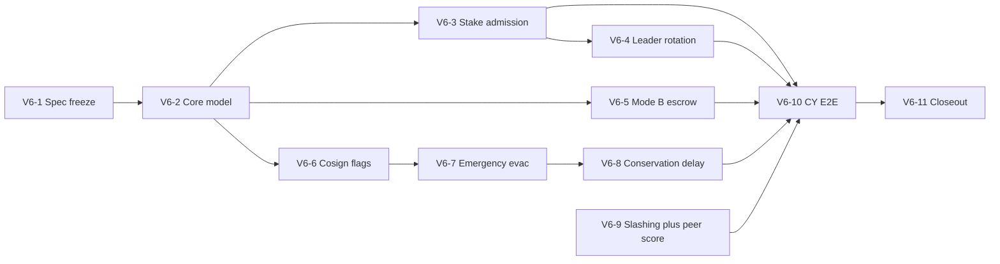

# MVP v6 — Consensus Evolution + Address Security Runtime

## Контекст и роль оркестратора

- **Предусловие:** V5 implementation-complete и **опубликован** (gates V5-1…V5-9, owner sign-off 2026-06-02); см. [CONCEPT_ROADMAP.md](../CONCEPT_ROADMAP.md) §MVP V5.
- **Якоря:** [docs/AGENT_PROMPT_orchestrator.md](../AGENT_PROMPT_orchestrator.md), [docs/plans/mvp_v5.md](mvp_v5.md), [docs/CONCEPT_ROADMAP.md](../CONCEPT_ROADMAP.md) §MVP V6, [DRAFT_WHITEPAPER-ru.md](../../DRAFT_WHITEPAPER-ru.md) §3–5.
- **Делегирование кода:** с **MVP v6** — двухрежимная модель (см. § **Делегирование и worktrees** ниже). Оркестратор правит `docs/`, `tasks/`, `scripts/`; ведёт **[docs/ORCHESTRATOR-NOTES.md](../ORCHESTRATOR-NOTES.md)** после каждого слайса.
- **Принцип:** Option A из roadmap R3 — **incremental PoA→PoS** в существующем `Chain::seal`. CometBFT/BFT replacement: **ADR в V7**, реализация — **Фаза 4** (см. [CONCEPT_ROADMAP.md](../CONCEPT_ROADMAP.md) §MVP V6/V7).



---

## Делегирование и worktrees (норма с V6)

### Когда какой режим

| Режим | Когда | Как |
|--------|--------|-----|
| **Worktree + bridge** | Продолжительный слайс с правками в `crates/` (не косметика): новый модуль, state machine, несколько файлов, umbrella из 2+ coding-слайсов | `cq_team_bridge_ctl` (дефолты CQDS, без дублирования routing-args) |
| **Sync subagent (Task)** | Точечные правки: один-два файла, review-fixes, doc-only gate, mechanical nits после PASS | `pwm-coding` → `pwm-review` → `pwm-testing`, **`run_in_background: false`** |

**Косметика (остаётся sync):** fmt/комментарии, переименование одного символа, правка одной строки в тикете/review, дополнение `docs/` без контрактного freeze.

**Продолжительный (worktree):** по умолчанию **V6-2…V6-8** (coding), крупные под-слайсы umbrella; **V6-9** soak — оркестратор + `pwm-testing`, без отдельного worktree на весь soak, если только скрипты/runbook.

### Worktree lifecycle (bridge)

Пути worktree и routing — **дефолты метаданных проекта** (под `.cqds/worktrees/`, в `.gitignore`). Синтаксис bridge-actions — **`cq_help` по запросу**, не в плане и не в handoff.

```text
1. tasks/<slice-id>.json (in_progress) + ticket id guard
2. bridge: worktree для ветки слайса → share_ticket
3. VS Code worker в worktree: implement → submit (оркестратор **не** подменяет coding Cursor Task при спящем воркере)
4. После submit — в Cursor: pwm-review → pwm-testing в worktree; не в main
5. Оркестратор в main: merge → метаданные → cleanup worktree/ветки
6. ORCHESTRATOR-NOTES + delegations[] в тикете
```

**Почему весь конвейер в worktree:** узкий `git diff` → меньше токенов на reasoning.

**Handoff:** цель слайса, `ticket_id`, ветка; skill `colloquium-cqds-mcp`; Windows testing — `CARGO_TARGET_DIR` по `AGENT_PROMPT_testing.md`. **Не** перечислять MCP-args и абсолютные worktree-пути — bridge резолвит сам.

**Параллелизм:** после **V6-2** непересекающиеся слайсы (например **V6-5** и **V6-6**) — **отдельные worktree**; merge в main по одному после полного in-worktree gate.

**Review/testing:** один «цикл конвейера» = coding→review→testing **в одном worktree** до PASS; fix-итерации — тот же worktree (bridge worker или sync `pwm-coding` с `cwd=worktree_root`).

### Дневник [docs/ORCHESTRATOR-NOTES.md](../ORCHESTRATOR-NOTES.md)

**Обязанность оркестратора (постоянная, с V6):** после закрытия каждого слайса (или под-слайса umbrella) дописывать секцию в дневнике. Файл создаётся в **V6-0 bootstrap** (todo `v6-delegation-notes-bootstrap`): шаблон таблицы + правила оценки.

**Минимальные поля на слайс:**

| Поле | Смысл |
|------|--------|
| `slice_id` | `tasks/…` / спринт V6-N |
| `delegation_mode` | `worktree_bridge` \| `sync_task` |
| `conveyor_cycles` | Число полных циклов coding→review→testing (1 = с первого раза) |
| `agents` | Кто делал: bridge worker / pwm-coding / pwm-review / pwm-testing |
| `token_estimate` | `{ input, output, total, source: tool\|estimate }` по агентам |
| `efficiency_rating` | `A` \| `B` \| `C` — субъективная оценка оркестратора |
| `reasoning_waste` | `none` \| `low` \| `high` — избыточный reasoning, повторный grep, дубли handoff |
| `lesson` | 1–2 предложения: что сократить в следующем handoff |

**Критерии `efficiency_rating` (ориентир):**

- **A:** 1 цикл конвейера, узкий handoff, без лишних повторов CQDS/чата.
- **B:** 2 цикла (типично review-fixes) или worktree оправдан объёмом.
- **C:** 3+ цикла, высокий `reasoning_waste`, или worktree/sync выбран неудачно — зафиксировать причину для ретроспективы.

Дневник **не** заменяет `tasks/*.json` (`delegations[]`, tokens) — дублирует выжимку для оптимизации процесса. При расхождении приоритет у тикета для аудита, у NOTES — для улучшения handoff.

### Спринты → режим делегирования (по умолчанию)

| Спринт | Режим |
|--------|--------|
| V6-1 | Оркестратор `docs/` + sync `pwm-review` |
| V6-2…V6-9 | Worktree + bridge; **review/testing только в worktree** |
| V6-10 | Оркестратор + `pwm-testing` (soak); runbook в `docs/` (sync) |
| V6-11 | Оркестратор docs + sync sprint-final `pwm-review`; сводка NOTES за V6 |

### Обновление канона

В **V6-0 / V6-1** добавить в [docs/AGENT_PROMPT_orchestrator.md](../AGENT_PROMPT_orchestrator.md) краткий §: worktree + cleanup, дефолты CQDS без дублирования контрактов, ссылка на `ORCHESTRATOR-NOTES.md`.

---

## Цель и demo-ready результат

**Цель:** первый экономически осмысленный шаг к PoS и cross-shard safety при реальных ставках; закрыть отложенный из V5 runtime по **address flags** (Whitepaper: корпоративный cosign, 24h conservation для исходящих `Transfer`).

**Главный demo-ready результат (оператор на CY/devnet):**

1. Валидатор с `staked_pwm` ниже `min_validator_stake` **исключается** из активного set на границе epoch.
2. При пропуске блока лидером следующий proposer срабатывает за **≤ 1** пропущенный блок (RFC16 extension + существующий cluster path).
3. `EXPORT` → locked balance на source; по timeout или успешному `IMPORT` — refund или release (Mode B).
4. Адрес с битом `CONSERVATION`: исходящий `Transfer` **pending** до `conservation_delay_blocks`; в окне — emergency routing / rescue по уже принятому V4/V5 policy path.
5. Адрес с `COSIGN_NON_DISABLEABLE`: `PolicyTx` не может снять обязательный `cosign_required`.
6. При активации `routing.emergency_redirect`: `activation_target` (= rescue), fee-free apply + эвакуация balance; **`tx-init`** заранее сохраняет подписанную activation в кошелёк или `--save-activation-tx`.

---

## Scope / Out of scope

| In scope (V6) | Out of scope (defer) |
|---|---|
| Stake-gated `ValidatorSet` + epoch transitions | CometBFT / ABCI / замена `Chain::seal` (ADR V7 → код Фаза 4) |
| RFC16 multi-proposer rotation (height/epoch index) | Full BFT `2f+1` among distinct validators |
| Slashing **stubs** (evidence in state, no fund seizure) | Production slashing enforcement |
| Mode B escrow (RFC 9 §A.5 → normative + code) | Settlement/import-export chain (RFC 9 §A.4) |
| Peer sync scoring (lightweight, sync/backfill only) | Full p2p reputation economy (RFC 15 non-goals) |
| ADR 0006 **runtime**: bits 0–1 | Domain lease auction runtime (V7) |
| Emergency **activation_target** + fee-free `ActivatePolicy` (RFC 6 + ADR 0011) | Auto-unstake / sweep staked без отдельного `Unstake` → **[ADR 0012](../adr/0012-emergency-stake-evacuation.md)** (V7 impl) |
| Snapshot schema **v4** (additive) | PQC signatures (V8+) |
| CLI/TUI inspect: epoch set, escrow, pending conservation | Production IPv4 claim registry |
| **`pwm-cli` `tx-init`:** автосборка и сохранение подписанной `ActivatePolicy` (wallet или отдельный файл) | Полная multi-rescue orchestration UI в TUI |
| CY multi-hour E2E (cross-shard + conservation) | Nginx/email reference impl (V7) |

---

## Принятые решения V6 (черновик для согласования)

- **Epoch model:** дискретные epoch с `epoch_length_blocks` в `GenCfg`; на границе epoch пересчитывается **active validator index list** по stake ≥ `min_validator_stake` (на аккаунте валидатора, привязанного к pubkey из `GenCfg.vals`). Bootstrap/static entries ниже порога → **inactive**, не удаляются из genesis wire (обратная совместимость devnet).
- **Leader rotation:** сохранить Variant A cluster attestation; расширить **proposer index** = `f(epoch, height, active_set_len)` (детерминированный round-robin по **active** set, не по полному genesis list). Отдельный ADR не заменяет lease/fencing (RFC 8).
- **Mode B:** `EXPORT` создаёт `CrossShardLock { export_id, amount, refund_policy, unlock_height }`; spendable balance уменьшается; `IMPORT` с proof снимает lock; timeout → `RefundExport` internal path или auto-apply на epoch/seal tick. Без HTLC/CLTV defer.
- **Conservation delay:** только **chain height** (`conservation_delay_blocks`, default ≈ 24h при 1s block ≈ 86400 — норматив в RFC, не wall-clock). Очередь `pending_outgoing: Vec<PendingTransfer>` в state или shard-level index — **минимальная** структура (simplicity gate: один тип записи).
- **COSIGN_NON_DISABLEABLE:** baseline `cosign_required` **виртуально always-on** для protected actions; `DeactivatePolicy` / weaken → stable `E_POLICY_FLAG_NON_DISABLEABLE`.
- **Slashing stub:** `EvidenceRecord { height, offender_idx, evidence_type, payload_hash }` append-only в shard state; **без** изменения balances.
- **Peer score:** integer score per peer id в **operator-local** или **non-consensus** cache first; если consensus-needed — только `GenCfg`-bounded table в snapshot v4 с явным ADR (предпочтение v6: **non-consensus** peer metadata в `pwmd` first, consensus table — только если review требует).
- **Эвакуация баланса (V6-7) — через расширенный `ActivatePolicy`, не скрытый sweep:**
  - Wire (additive): `ActivatePolicy { policy_id, activation_target: AccountId }`.
  - Для `routing.emergency_redirect`: `activation_target` **MUST** совпадать с `Account.rescue_address` (дублирование в tx для явности и подписи); любой другой адрес → stable reject (`E_POLICY_ACTIVATION_TARGET_MISMATCH` или аналог).
  - После rescue cosign и прочих gate V4: в **том же** `apply_tx` консенсус (1) активирует emergency + `finalized`, (2) переносит **весь spendable `balance_pwm`** на `activation_target` **той же семантикой**, что обычный same-shard value transfer (дебет отправителя / кредит получателя, nonce, балансовые инварианты) — без отдельного пользовательского `TxBody::Transfer`.
  - **Комиссия:** транзакция активации политики с эвакуацией — **`fee = 0`** (нормативно: активация не взимает fee, т.к. создаёт издержки для средств, пойдущих будущим маршрутом; эвакуация в рамках того же apply — также без отдельной fee, если иное не задано GenCfg).
  - **Будущее (ADR 0011):** `activation_target` как общий параметр активации для других политик (whitelist/blacklist sender sets, routing targets) — в V6 только emergency binding + задел в ADR, без runtime whitelist.
  - **Fee-free activation (общее правило):** `PolicyTx` с `ActivatePolicy` — **`fee = 0`** (нормативно для всех активаций в V6; SetPolicy/Deactivate — без изменения fee-модели V4, если иное не в ADR 0011). Обоснование владельца: активация навязывает будущие маршрутные издержки на переводимые средства.
  - **Out of scope v6:** `staked_pwm_raw` (V7: [ADR 0012](../adr/0012-emergency-stake-evacuation.md)), marks, cross-shard target; runtime whitelist/blacklist через `activation_target` (только ADR 0011 future). Обоснование: LKC / [Post_MVP_target_model(anti-abuse).md](../Post_MVP_target_model(anti-abuse).md).
  - **CLI preparedness (V6-7):** при corporate `tx-init` с `rescue_address` и начальной политикой `routing.emergency_redirect` (типично `dormant`) `pwm-cli` **автоматически** собирает, подписывает и **сохраняет** готовую `ActivatePolicy` (`fee=0`, `activation_target=rescue`) — в файл кошелька и/или в отдельный файл по флагу; rescue cosign включается, если переданы те же rescue-wallet аргументы, что у `tx-policy-activate`.

---

## Спринты (11)

### Sprint V6-1: Spec / RFC / ADR freeze

**Цель:** нормативные контракты до кода.

**Scope:**

- RFC 4 (validators): stake-gated admission, epoch boundary, active vs registered set.
- RFC 16 addendum: multi-proposer index over **active** set; failover timing target ≤1 block.
- RFC 9 §A.5: Mode B state machine, timeout/refund, griefing boundaries, fork-compat note.
- **ADR 0009** (новый): *Address flags runtime enforcement* — нормативно расширяет [ADR 0006](../adr/0006-address-flags-and-nondisableable-profiles.md): mempool/seal/conservation queue, interaction с emergency routing.
- **RFC 6 addendum:** расширение `ActivatePolicy` + fee-free activation; эвакуация emergency как balance move на `activation_target`.
- **RFC 10 addendum:** `prepared_policy_activation` (или эквивалент) в wallet `accounts[]` / encrypted payload — хранение подписанной activation tx с метаданными nonce/target.
- **ADR 0011** (новый): *Policy activation target* — семантика поля, emergency MUST match rescue, future uses (allowlist/denylist activation targets), fee waiver rules и anti-abuse bounds.
- **ADR 0010** (новый): *Slashing evidence stubs* — record-only, no seizure.
- RFC 15 addendum или короткий RFC 20: peer scoring для sync (out of scope: economic reputation).
- Обновить [docs/plans/mvp_v6.md](mvp_v6.md) (этот план) и cross-refs в [CONCEPT_ROADMAP.md](../CONCEPT_ROADMAP.md).

**Acceptance:** нет открытых `TBD` по wire полям V6; ADR 0006 помечен «enforcement = V6»; pwm-review PASS на spec-only слайс.

---

### Sprint V6-2: Core state model + snapshot v4

**Цель:** типы и serde без полного поведения.

**Scope (ориентир крейтов):**

- `GenCfg`: `min_validator_stake`, `epoch_length_blocks`, `conservation_delay_blocks`, Mode B timeout params.
- `PolicyAction::ActivatePolicy`: поле `activation_target: AccountId` (optional в wire для non-target policies → `None` / omitted until used; для emergency — required).
- Shard/chain state: `epoch_counter`, `active_validator_indices`, `CrossShardLock`, `EvidenceRecord`, `PendingConservationTransfer`.
- Snapshot **v4** migration gate (v3→v4 как в V5-2).
- Stub validators в `validate_tx_shape` / reject codes (additive `E_*`).

**Acceptance:** `cargo check --workspace`; serde round-trip v3→v4; **no** enforcement logic yet.

**Декомпозиция coding (umbrella + slices 1–5), по аналогии с V5-2.**

| # | Ticket | Scope |
|---|--------|--------|
| 1 | `tasks/20260605-v6-s2-slice1-gencfg.json` | GenCfg V6: `min_validator_stake`, `epoch_length_blocks`, `conservation_delay_blocks`, `cross_shard_lock_timeout_blocks`; defaults + serde tests |
| 2 | `tasks/20260605-v6-s2-slice2-activate-policy-wire.json` | `PolicyAction::ActivatePolicy { policy_id, activation_target: Option<AccountId> }`; signing + JSON round-trip; mechanical compile fixes |
| 3 | `tasks/20260605-v6-s2-slice3-chain-state-types.json` | V6 chain/shard types on `State` or extension: `epoch_counter`, `active_validator_indices`, `CrossShardLock`, `EvidenceRecord`, `PendingConservationTransfer` |
| 4 | `tasks/20260605-v6-s2-slice4-reject-stubs.json` | Additive `TxError` / wire rejects (`E_POLICY_*`, `E_CONSERVATION_*`, `E_EVIDENCE_*`); `validate_tx_shape` stubs only — no apply enforcement |
| 5 | `tasks/20260605-v6-s2-slice5-snapshot-v4.json` | `pwmd` snapshot v4 + v3→v4 migration + replay test |

Umbrella: `tasks/20260605-v6-sprint2-core-model.json`. Worktree: `v6/20260605-v6-sprint2-core-model`. Порядок строгий: 1→5. Enforcement runtime — **V6-3…V6-8**, не смешивать.

---

### Sprint V6-3: Stake-gated validator admission

**Цель:** epoch boundary пересчитывает active set; seal использует только active proposers.

**Scope:** `pwm-core` chain/seal + genesis defaults для devnet; тесты: below-threshold excluded, at-threshold included, epoch rollover.

**Acceptance:** критерий roadmap «нода с stake < порога отклоняется на epoch boundary» — автотест PASS.

---

### Sprint V6-4: Leader rotation (RFC 16 extension)

**Цель:** детерминированная смена proposer при пропуске / по schedule.

**Scope:** `pwmd` cluster path + `Chain::seal` proposer selection; интеграция с V6-3 active set.

**Acceptance:** тест/harness «missed block → next leader ≤ 1 block» PASS на CY profile или lib harness.

---

### Sprint V6-5: Mode B cross-shard escrow

**Цель:** lock + timeout refund end-to-end в `pwm-core` state machine.

**Scope:** расширение `EXPORT`/`IMPORT` в [rfc/9-crossdomain-roaming.md](../rfc/9-crossdomain-roaming.md) as-implemented path; cross-shard lib tests + минимальный operator script.

**Acceptance:** sender видит locked balance; timeout возвращает средства; happy IMPORT снимает lock.

---

### Sprint V6-6: `COSIGN_NON_DISABLEABLE` enforcement

**Цель:** bit 0 из адреса влияет на `evaluate_policy` / policy mutations.

**Scope:** decode flags из `decode_bech32dx` (уже есть в tests); reject weaken paths; wallet/CLI copy «enforced».

**Acceptance:** `cargo test -p pwm-core policy_flag_*` green; no new `Account.address_flags` field.

---

### Sprint V6-7: Emergency routing — activation target + balance evacuation

**Цель:** эвакуация spendable остатка при активации emergency — **явная** транзакция активации с `activation_target`, валидация и apply как у обычного перевода, **без fee** на активацию.

**Контекст (продукт):** Live Key Chip / живые ключи ([Post_MVP_target_model(anti-abuse).md](../Post_MVP_target_model(anti-abuse).md)) — после активации на compromised-адресе не остаётся spendable PWM; входящие по-прежнему redirect (V4).

**Нормативная модель (зафиксировать в V6-1 / ADR 0011):**

```text
PolicyTx {
  fee: 0,   // обязательно для ActivatePolicy с evacuation semantics
  action: ActivatePolicy {
    policy_id: routing.emergency_redirect,
    activation_target: <AccountId>,  // MUST == rescue_address on-chain
  },
  cosign: rescue,
}
→ apply: activate + finalize + debit sender.balance_pwm + credit activation_target
         (same invariants as Transfer; не отдельный TxBody)
```

**Scope:**

- `tx.rs`: расширить `ActivatePolicy`; signing canonicalization; `validate_tx_shape`: target required for emergency, MUST match `rescue_address`, same-shard, initialized recipient.
- `state.rs`: fee waiver для eligible `ActivatePolicy`; balance evacuation через существующий transfer/balance path (не параллельная «скрытая» ветка).
- Reject codes: target mismatch, fee non-zero when waiver required, cross-shard target.
- Тесты: balance 100 + fee=0 activation → rescue +100, sender 0; wrong target → reject; fee>0 → reject; zero balance → activate without transfer leg.
- **pwm-cli `tx-init` (расширение):**
  - Триггер: `init_v4` с `--rescue-address` и `--initial-policy routing.emergency_redirect` (и при необходимости другие политики — activation bundle только для emergency).
  - После подписи `Init` (и до/после `post_signed_tx` init — зафиксировать в impl): собрать `PolicyTx` `ActivatePolicy { policy_id, activation_target: rescue }`, `fee=0`, nonce = init_nonce+1 (или explicit `expected_nonce` в метаданных сохранения).
  - Подпись владельца обязательна; rescue cosign — если заданы `--rescue-wallet` / `--rescue-master` (reuse `RescueCosignArgs` из `tx-policy-activate`).
  - **Сохранение (два канала):**
    - **По умолчанию** (при `--wallet` + `--upgrade-wallet`): additive поле в wallet payload / `accounts[]` — например `prepared_policy_activation` (canonical JSON или `signed_tx_b64` + `policy_id` + `activation_target` + `expected_nonce`); RFC 10 addendum в V6-1/V6-7.
    - **Опция** `--save-activation-tx <path>`: отдельный файл (JSON: signed tx + metadata) без изменения кошелька.
  - `tx-policy-activate`: флаги `--activation-target` (default из `rescue_address` on-chain / wallet meta); возможность **не** пересобирать tx, а загрузить из wallet/`--activation-tx-file` для `tx-send`/broadcast.
- **Документация:** [pwm-cli.md](../pwm-cli.md) — сценарий «init + cold-stored activation» для LKC.
- ADR 0011: future allowlist/denylist uses of `activation_target` (spec-only bullets, no V6 code).

**Зависимости:** **V6-2** (wire в core model или отдельный slice V6-7a wire + V6-7b apply — по объёму); **V6-6** до conservation.

**Acceptance:**

- Core: emergency activation с `activation_target == rescue`, `fee=0` → spendable эвакуирован; `cargo test -p pwm-core emergency_activation_*` green; signing round-trip для нового поля.
- CLI: `pwm tx-init … --rescue-address … --initial-policy routing.emergency_redirect:dormant --wallet w.yaml --upgrade-wallet` → в wallet появляется сохранённая activation tx; `pwm tx-init … --save-activation-tx emergency-act.json` → файл существует и десериализуется в `SignedTx`; round-trip test в `pwm-cli`.
- CLI: без rescue cosign ключей — сохраняется owner-signed activation (метка `rescue_cosign_pending: true` в meta); с rescue args — полная cosign envelope.

**Декомпозиция coding (ориентир):** slice A `pwm-core` wire+apply; slice B `pwm-cli` init+wallet persistence; slice C tests+docs.

**Делегирование:** worktree + bridge; review/testing **в worktree** (оба slice в одном worktree V6-7, если один umbrella-тикет).

**Simplicity gate:** один путь движения value — reuse debit/credit helpers из `Transfer`; не вводить отдельный тип `ProtocolSweep`.

---

### Sprint V6-8: `CONSERVATION` delayed transfer

**Цель:** bit 1 — исходящие `Transfer` pending до `unlock_height`; seal выпускает по высоте.

**Scope:** mempool admission + `apply_tx` defer + cancel/redirect hooks с V4/V6-7 emergency (активация emergency в окне — fee-free `ActivatePolicy` + evacuation по V6-7).

**Acceptance:** transfer не в блок до delay; после delay — исполняется; emergency в окне — sweep или redirect по spec.

**Simplicity risk:** если очередь раздувается — cap pending per account в GenCfg (spec в V6-1).

---

### Sprint V6-9: Slashing stubs + peer sync scoring

**Цель:** evidence append-only; базовый score влияет на sync peer order (не consensus).

**Scope:** `pwmd` sync/backfill; optional RPC diagnostic `/v1/peers/scores` (если не раздувает API freeze — иначе operator-only log).

**Acceptance:** duplicate evidence id rejected; score updates deterministic from observable sync facts.

---

### Sprint V6-10: CY cluster E2E (pre-closeout)

**Цель:** живой прогон как [V5-9](mvp_v5.md) — cross-shard Mode B + conservation + **emergency sweep** smoke на CY launchers.

**Deliverables:** runbook `docs/runbooks/v6-cy-cluster-precloseout-soak.md`; отчёты в `tmp/cy-e2e-v6-*.md`.

---

### Sprint V6-11: Integrated gate + closeout

**Цель:** закрыть V6 как coherent release.

**Scope:** `docs/MVP-checklist.md` блок 0v6; CONCEPT_ROADMAP §V6 `[x]`; `docs/GLOSSARY.md` (sprint-final review); `CHANGELOG.md`; финальный `pwm-review` «финальное ревью спринта V6»; backlog V7 явно отделён.

**Acceptance:** `cargo fmt --check`, `cargo test -p pwm-core --lib`, `cargo test -p pwmd --lib`, operator smoke script; все критерии готовности §V6 roadmap покрыты или deferred с owner note.

**Статус (2026-06):** sprint gates закрыты (`d251fb5`, docs `13d1b66`). **Не путать с публикацией версии** — см. § Pre-publication ниже.

---

### Pre-publication (после V6-11, до mirror release)

Владелец: длительный **stability soak** (минимум **50k блоков**, spot-check address flags в процессе). Затем комплексное ревью как у V5:

| Фаза | Владелец | Артефакт |
|------|----------|----------|
| Stability soak ≥50k | operator | runbook [runbooks/v6-owner-stability-soak-50k.md](runbooks/v6-owner-stability-soak-50k.md); отчёт `tmp/v6-stability-50k-*.md` |
| Rust code audit | pwm-review | шаблон [reviews/20260528-v5-mvp-rust-code-audit-review.md](../reviews/20260528-v5-mvp-rust-code-audit-review.md) → `docs/reviews/*v6*mvp-rust-code-audit*` |
| Docs / manuals refresh | pwm-review (+ polish при необходимости) | `pwm-cli.md`, operator guides, `CONCEPT_PROGRESS.md` |
| Owner sign-off + publication | operator | umbrella `tasks/20260603-v6-prepublication-umbrella.json`; mirror `dry_run→apply` |

**Umbrella ticket:** `tasks/20260603-v6-prepublication-umbrella.json`

---

## Обязательный ритуал оркестратора (каждый слайс)

- `tasks/<id>.json`: `in_progress`, `delegation_mode`, acceptance, planned `delegations[]`.
- Перед bridge: `scripts/_orchestrator_ticket_id_guard.py <ticket_id>`.
- Prolonged coding → worktree lifecycle (§ **Делегирование и worktrees**); косметика → sync Task.
- Конвейер: implementation → **`pwm-review`** → **`pwm-testing`**; для worktree-слайса — **все шаги в `worktree_root`** (sync, не фон).
- **После закрытия слайса:** дописать секцию в [docs/ORCHESTRATOR-NOTES.md](../ORCHESTRATOR-NOTES.md) (`conveyor_cycles`, `efficiency_rating`, `reasoning_waste`, `lesson`).
- `PASS_WITH_NITS` mechanical → auto-close без опроса владельца (как в `AGENT_PROMPT_orchestrator.md`).

---

## Межспринтовые гейты (как V5)

- **Simplicity Gate:** без VM; без нового async loop без обоснования; escrow/conservation — finite state, pure transitions.
- **Additivity Gate:** wire additive; snapshot v4 gate; unknown version → reject.
- **Layer gate:** L4 policy не меняет L1 `TxBody` canonical form.
- **ADR gate:** slashing stub **не** меняет balances; peer score **не** влияет на emission без отдельного ADR.

---

## Риски и контрмеры

| Риск | Контрмера |
|------|-----------|
| Conservation + mempool non-determinism | Только height-based unlock; deterministic ordering pending queue |
| Mode B fork с legacy EXPORT | Feature flag / `GenCfg.mode_b_enabled`; devnet-only default first |
| Epoch transition рассинхрон cluster | Epoch change = protocol event в cluster profile docs; CY soak |
| Scope creep domain auction | Explicit out-of-scope в V6-1 freeze |
| Snapshot v4 policy+escrow size | Cap lists; archive note в ADR 0004 (Bootstrap — future) |
| Emergency activation abuse (fee=0) | Только bound policies (emergency + explicit ADR list); target MUST match rescue; same-shard |
| activation_target wire compat | Old ActivatePolicy without field: reject or legacy path — spec in V6-1 (prefer explicit reject post-v4 devnet) |
| Prepared activation nonce drift | Wallet meta: `expected_nonce`; CLI warn if on-chain nonce differs before broadcast |
| Review в main при параллельных worktree | Жёсткое правило: review/testing только в worktree слайса |

---

## Артефакт после согласования

Сохранить утверждённый текст в **[docs/plans/mvp_v6.md](mvp_v6.md)** (frontmatter `todos` как в mvp_v5.md, статусы `pending`).

Создать **[docs/ORCHESTRATOR-NOTES.md](../ORCHESTRATOR-NOTES.md)** (шаблон дневника + первая запись «V6 process bootstrap»).

Обновить [docs/AGENT_PROMPT_orchestrator.md](../AGENT_PROMPT_orchestrator.md): § worktree + NOTES (ссылка на план V6).

[CONCEPT_ROADMAP.md](../CONCEPT_ROADMAP.md) синхронизирован (v0.19): V6 без CometBFT; V7 — BFT ADR-gate; Фаза 4 — код миграции.

Первый тикет при старте: `tasks/<YYYYMMDD>-v6-sprint1-spec-adr-freeze.json` + guard `scripts/_orchestrator_ticket_id_guard.py`.

---

## Сводка для владельца

MVP v6 объединяет **консенсусный** трек, **address flags runtime**, и **emergency evacuation** через расширенный fee-free `ActivatePolicy` + `activation_target` (эвакуация как обычный balance move, ADR 0011 — задел под allowlist/denylist). Порядок: spec → model → … → **V6-7 activation/evac** → conservation → soak → closeout (11 спринтов).

**Процесс:** worktree + bridge для prolonged слайсов; **весь** конвейер (включая review/testing) — **в том же worktree** для узкого git scope. **`docs/ORCHESTRATOR-NOTES.md`** — дневник эффективности после каждого слайса.
