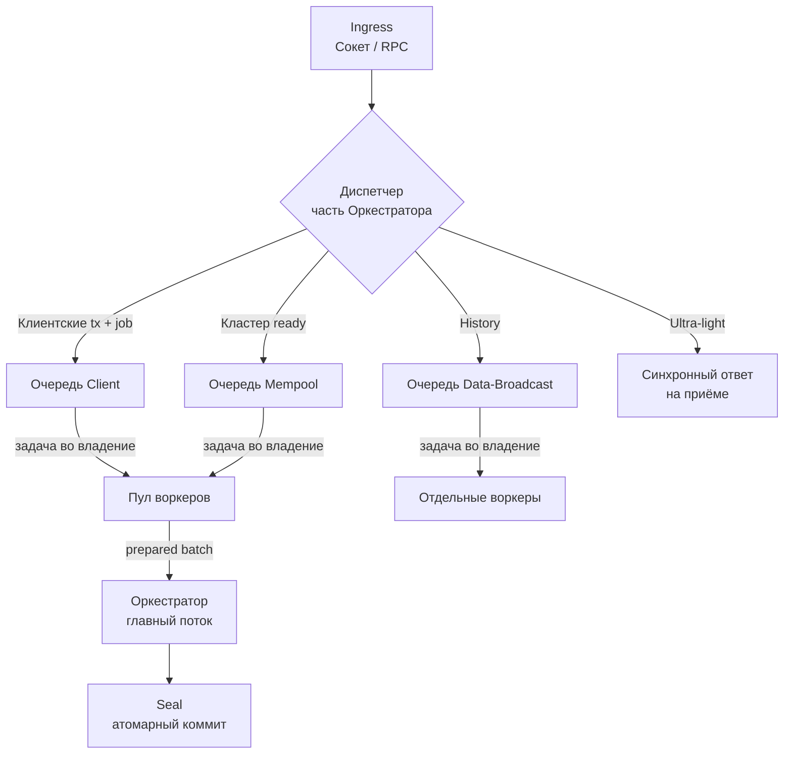

# MVP V7 Sprint 1 (V7-S1): Подготовка многопоточной обработки транзакций (Pipeline + Worker Pool)

**Цель спринта:** Сломать текущий потолок ~3 tx/s. Внедрить pipeline-архитектуру на основе неблокирующих очередей, пула воркеров и лёгкого оркестратора, чтобы тяжёлая работа не блокировала основной путь `seal`.

**Якорь в головном плане:**  
См. раздел **Sprint 1 (V7-S1)** в [mvp_v7.md](../mvp_v7.md).

**Связь с головным планом:**  
Детальные схемы, модели очередей, правила владения задачами, dispatch flows и реализации прорабатываются здесь.  
Головной план содержит только цели, границы и ключевые решения высокого уровня.

## Архитектурный паттерн и методология

Архитектура этого спринта — **SEDA (Staged Event-Driven Architecture)**: стадии обработки, соединённые bounded-очередями, пул OS-потоков на CPU-bound работу, оркестратор только перемещает данные и коммитит seal.

**Нормативный документ:** [`docs/adr/0013-tx-pipeline-seda.md`](../adr/0013-tx-pipeline-seda.md) — имя паттерна, выбор инструментария (tokio::sync без новых крейтов), методология разработки (pure functions first → channel contracts → worker isolation → integration last) и методология отладки (profiling, tracing spans, ThreadSanitizer, property-test детерминизма).

Coding worker обязан прочитать ADR 0013 до начала Slice 1.

**Спектр оптимизации:** [`docs/plans/perf-optimization-spectrum.md`](perf-optimization-spectrum.md) — три тира оптимизации (SEDA → ClickHouse backend → BFT), эскалационные пути если тир 1 не даёт ≥50 tx/s, архитектура `ShardStateCert` (сертифицированный кэш состояния шарды с подписью ноды), совместимость с CometBFT.

## Ключевые архитектурные решения (из обсуждения)

- **Отдельные очереди** по классам сообщений (комфортно для DoS: «очередь заполнена — приходите завтра»).
- **Пул воркеров**, которые получают задачу **во владение** целиком (включая сокет для ответа клиенту).
- **Оркестратор-диспетчер**:
  - Забирает задания из очередей по **временному порядку**.
  - Передаёт свободному или affinity-воркеру.
- **Affinity-воркеры**: часть пула может быть постоянно привязана к горячей очереди (например, проверка транзакций) и конкурировать внутри неё без постоянной оркестрации.
- **Мягкая защита от DoS**: лимит одновременно активных воркеров на каждую очередь.
- **Неблокирующие очереди + события/семафоры** для сигнализации и backpressure (минимум тяжёлых мьютексов на горячем пути).
- **Главный поток (orchestrator)**: в основном перемещает данные, координирует и выполняет `seal`. Решение «отдельный OS-тред или tokio-задача» откладывается.

### Диспетчеризация сети (конкретная модель)

1. **Транзакции клиентов**
   - Идут в фоновую обработку.
   - Сокет помечается внутренним **job**.
   - Задание попадает в очередь → воркер получает его вместе с сокетом.

2. **Пред-проверенные транзакции из кластера**
   - Приходят уже готовыми к запечатыванию.
   - Сразу в очередь «на мемпул» (ready-to-seal).
   - Могут обслуживаться affinity-воркерами.

3. **Запросы на подгрузку истории / backfill**
   - Отдельная очередь `data-broadcast`.
   - Полностью изолированный путь.

### Классификация операций по глубине доступа (правило занятия воркера)

- **Ультра-лёгкие** (микросекунды): текущий номер блока, head и т.п.
  - Можно отвечать **синхронно** рано — лучше всего на приёме запроса из сокета.
  - Не занимают воркера.

- **Требующие копания в блокчейн** (доступ к состояниям аккаунтов, политики на реальном state, исторические данные и т.п.):
  - Диспетчер-оркестратор **обязательно** занимает свободного воркера.
  - Промахи кэша состояний аккаунтов пока оставляем за пределами MVP функциональности.

## Цели и приёмка

- Диагностика текущих bottleneck'ов с воспроизводимыми цифрами «до».
- Реализация модели очередей + пула воркеров + оркестратора-диспетчера.
- Сохранение детерминизма и изоляции путей.
- Минимум работы внутри критического пути `seal`.

**Критерий приёмки спринта (верифицируемый):**

> `python scripts/cy_cluster_transfer_ramp_soak.py` со стандартным ramp-профилем на одной ноде даёт sustained ≥ 50 tx/s на протяжении ≥ 60 секунд при нулевом количестве seal-детерминизм-ошибок.

- Baseline-измерение (до любых изменений) фиксируется и коммитится в `docs/reviews/v7-s1-slice0-baseline-profile.md` как часть закрытия Slice 0. Без зафиксированного baseline спринт не считается закрытым.
- Throughput-цель ≥ 50 tx/s определена в `mvp_v7.md` § Demo-ready result п. 6 и § Межспринтовые гейты. Если после Slice 0 профилирование покажет, что узкое место I/O-bound (диск/снапшот), а не CPU — требуется owner sign-off перед переходом к Slice 1 с возможным пересмотром подхода.
- Дополнительный gate детерминизма: property-тест «результат батча при 1 потоке ≡ при N потоках» должен проходить.

## Scope Gate OUT (Sprint 1)

Следующее явно **исключено** из Sprint 1. Coding worker не вправе брать эти задачи без явного sign-off оркестратора:

- Sharded `apply_tx` (требует отдельного ADR).
- Замена tokio async runtime.
- Оптимизация кэша состояний аккаунтов (account-state cache / cache-miss handling).
- Любой BFT-код (CometBFT или custom) — V7-6 только ADR.
- Изменения wire-протокола или snapshot-формата (кроме минимально необходимых для нового pipeline, с явным migration note).
- Cross-shard dispatch изменения.
- GPU/SIMD-оптимизация верификации подписей.
- Полноценный /v2/* API surface.

## Декомпозиция

Slice breakdown нормативен для этого спринта. Отклонения требуют sign-off оркестратора до продолжения.

### Slice 0 — Диагностика + классификация операций

**Цель:** Точно установить узкое место (CPU-bound pre-seal, I/O-bound, lock contention) и зафиксировать baseline.

**Pre-condition:**
- `cargo test -p pwm-core -p pwmd` проходит на main branch без изменений.
- `scripts/cy_cluster_transfer_ramp_soak.py` запускается и завершается без ошибок (независимо от TPS).

**Post-condition:**
- `docs/reviews/v7-s1-slice0-baseline-profile.md` закоммичен: содержит baseline TPS-измерение, flame graph или аналогичные данные профилирования, классификацию узкого места как одного из: {CPU-bound в `validate_tx_shape`, CPU-bound в `apply_tx`, I/O-bound диск/снапшот, lock contention в `seal`}.
- Если узкое место — I/O-bound: owner получил уведомление, sprint не продолжается до sign-off.

**Rollback:** Slice 0 не меняет production-код в `crates/`. Rollback = удалить профилировочные скрипты если добавлялись (или оставить как non-breaking additions). Нет state-миграций.

---

### Slice 1 — Модель очередей + диспетчеризация трёх путей

**Цель:** Реализовать очереди по классам сообщений и dispatcher-логику.

**Pre-condition:**
- Slice 0 post-condition верифицирован (baseline profile закоммичен, узкое место классифицировано как CPU-bound pre-seal, не I/O).
- `cargo test -p pwm-core -p pwmd` проходит.

**Post-condition:**
- `crates/pwmd/src/` содержит типы очередей и dispatcher.
- `cargo test -p pwmd` проходит, включая unit-тесты для всех трёх путей диспетчеризации (client tx, cluster ready, data-broadcast).
- Queue types компилируются без `unsafe`-предупреждений не из явно разрешённых зон.
- Нет изменений wire-протокола или snapshot-формата.

**Rollback:** Revert изменений `crates/pwmd/src/` к HEAD на момент закрытия Slice 0. Нет state-изменений — rollback чистый.

---

### Slice 2 — Пул воркеров (владение, affinity, backpressure)

**Цель:** Воркеры получают задачи целиком во владение; affinity; bounded queues + семафоры для backpressure.

**Pre-condition:**
- Slice 1 post-condition верифицирован (queue types и dispatcher компилируются, unit-тесты проходят).
- `cargo test -p pwmd` проходит.

**Post-condition:**
- Worker pool стартует, соблюдает per-queue лимиты.
- Affinity-воркеры функционируют (тест: affinity-воркер обрабатывает только свою очередь).
- Backpressure (bounded queue + semaphore) измеримо блокирует ingress при насыщении — тест: при заполнении очереди новые входящие получают rejection, процесс не падает и не зависает.
- `cargo test -p pwmd` проходит.

**Rollback:** Revert worker pool additions; queue model из Slice 1 остаётся нетронутым (отдельный модуль). Нет snapshot-изменений.

---

### Slice 3 — Интеграция с оркестратором и путём seal

**Цель:** `pwmd` обрабатывает запросы через новый pipeline; `seal` вызывается только из orchestrator-треда.

**Pre-condition:**
- Slice 2 post-condition верифицирован (worker pool unit-tested, backpressure работает).
- `cargo test -p pwmd` проходит.

**Post-condition:**
- `pwmd` binary стартует и принимает запросы через новый pipeline.
- `Chain::seal` вызывается исключительно из orchestrator-треда (ревью кода или lint-проверка подтверждает отсутствие других call-sites).
- Базовый smoke: одна нода обрабатывает ≥ 10 tx/s в упрощённом тесте (не полный ramp, достаточно для проверки pipeline connectivity).
- `cargo test -p pwmd -p pwm-core` проходит.
- Если изменился snapshot-формат — migration note зафиксирован в handoff и `docs/reviews/`.

**Rollback:** Revert orchestrator integration; восстановить предыдущий call-site `Chain::seal`. Если изменился snapshot-формат — требуется state reset (документировать в handoff перед началом Slice 3).

---

### Slice 4 — Полная интеграция, DoS-тесты, ramp-соаки, документация

**Цель:** Достичь критерия приёмки спринта и задокументировать результаты.

**Pre-condition:**
- Slice 3 post-condition верифицирован (одна нода ≥ 10 tx/s в базовом тесте).
- `cargo test -p pwmd -p pwm-core` проходит.

**Post-condition:**
- `python scripts/cy_cluster_transfer_ramp_soak.py` со стандартным ramp-профилем на одной ноде даёт sustained ≥ 50 tx/s за ≥ 60 секунд при нулевом количестве seal-детерминизм-ошибок.
- Property-тест детерминизма проходит: результат батча при 1 потоке ≡ при N потоках.
- DoS-тест: насыщение очереди не вызывает crash или deadlock процесса.
- Результаты ramp-соак закоммичены в `docs/reviews/v7-s1-slice4-ramp-results.md`.
- Диаграммы Mermaid в этом файле обновлены до финальной архитектуры.

**Rollback (если ramp-цель не достигнута):** Revert pipeline changes, восстановить V6 sequential path; зафиксировать findings для re-planning. **Если ramp достигнут, но property-тест детерминизма не проходит:** зафиксировать на состоянии Slice 3, не мержить, эскалировать к оркестратору.

## Известные риски (Sprint 1)

| Риск | Вероятность | Контрмера |
|------|-------------|-----------|
| Узкое место I/O-bound (диск/снапшот), а не CPU — pipeline не даст ≥50 tx/s | Средняя | Slice 0 диагностирует первым; escalation path к оркестратору если I/O-bound |
| Deadlock / livelock в lock-free очереди под adversarial нагрузкой | Средняя | Bounded queues + backpressure тест в Slice 2; DoS-тест в Slice 4 |
| Non-determinism при гонке affinity-воркеров за батч | Средняя | Property-тест (1 поток ≡ N потоков) обязателен в Slice 4; не мержить без прохождения |
| Новый dispatcher конфликтует с tokio async runtime в `pwmd` | Низкая | Решение «отдельный OS-тред vs tokio-задача» откладывается до прояснения (Slice 1); явный выбор фиксируется в handoff |
| ≥50 tx/s на single node достигнуто, но degradation при 2+ нодах | Низкая | В рамках Sprint 1 тестируем только single-node; multi-node — предусловие V7 devnet gate |

## Артефакты спринта (в т.ч. схемы)

Все детальные артефакты (особенно диаграммы) размещаются здесь.

### Mermaid-диаграммы (план)
(будут добавлены по мере проработки)

> **Примечание к диаграмме:** Оркестратор — это **главный поток**, который владеет и диспетчером (раздаёт задачи воркерам), и шагом Seal (принимает prepared batch и коммитит). Воркеры — подчинённые; они не "выше" оркестратора в pipeline, а работают параллельно и возвращают подготовленный результат. Dispatcher является частью оркестратора, а не отдельным компонентом.

- Диспетчеризация (3 пути + read)
- Жизненный цикл задания
- Модель пула воркеров + affinity + лимиты
- Backpressure

Дополнительно:
- Семантика очередей
- Правила владения задачей
- Интерфейсы оркестратор ↔ очереди ↔ воркеры
- Обновления runbook'ов

**Примечание:** Полные версии схем и описаний — в этом файле (не в головном плане).

---

*Черновик создан на основе обсуждения в чате. Будет дорабатываться по мере прояснения деталей.*