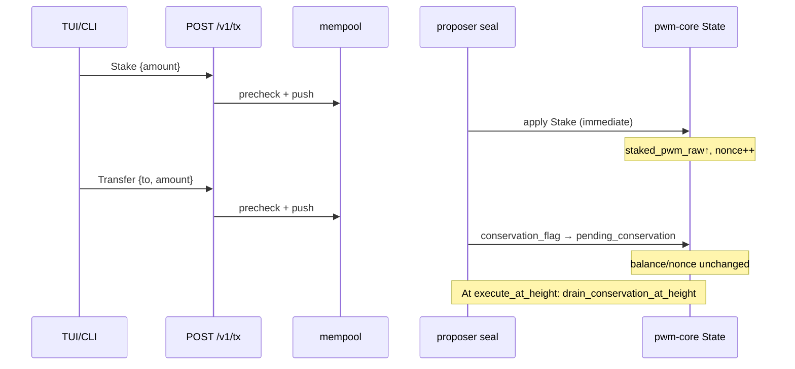

# Trace: flags=2 account — stake + conservation transfer (CY lab)

**Date:** 2026-06-17  
**Context:** Owner soak / TUI observation; cluster head ~59.8k  
**Account (flags=2 / CONSERVATION):** `2c329e536002d825096bfa285a942ee3963d73ad7f2c475036094df15b71050d` (`pwm1-CY/32-f9E536002-…`, `m/0/1428470`)  
**RPC:** `http://127.0.0.1:3030` (proposer)

---

## Executive summary

| Tx kind | On-chain status | Why TUI felt “slow” |
|---------|-----------------|---------------------|
| **Stake** | **Applied** (`staked_pwm_raw=10_000_000_000_000`, nonce advanced to 3 before pending transfer) | Stake is **immediate** for conservation addresses; marks updated (`marks_last_block=59545`) |
| **Transfer** (outgoing) | **Pending** in `pending_conservation` (nonce **3**, not debited yet) | CONSERVATION delays **Transfer** only; `bal`/`nonce` unchanged at enqueue (`nonce:3->3` in log) |
| **BurnMark** | Applied at nonce 2→3 | Observed in proposer log |

Stake and conservation transfer are **different code paths**. “Не сработало визуально” относилось к **исходящему Transfer**, не к Stake.

---

## Evidence sources

1. Proposer console (terminal capture): `tx commit delta` lines  
2. `GET /v1/account/<id>` and `pwm account-info`  
3. On-disk snapshot `tmp/state-cy-proposer/pwm-data.json` (`pending_conservation`, account row)

---

## On-chain state (2026-06-17, head ≈59829)

```json
{
  "balance_pwm": "5000000000000",
  "staked": "10000000000000",
  "nonce": 3,
  "marks": 30000000,
  "marks_last_block": 59545,
  "flags_low10": 2
}
```

CLI `account-info` matches: `staked=10000000000000`, `marks_effective=30000000`.

---

## Pending conservation transfer

From `pwm-data.json` → `state.pending_conservation[0]`:

| Field | Value |
|-------|--------|
| `nonce` | 3 |
| `enqueue_height` | **59650** |
| `execute_at_height` | **146050** |
| `delay_blocks` | **86400** (~24h @ 1s blocks) |
| `amount_pwm` | 300_000_000_000 (300k PWM raw) |
| `recipient` | `2c77ba7f…` (address-book **flags=1** / cosign account) |
| `tx_hash` | `5b7c84dc…` |

Proposer log at **11:11:42** (height **59650**):

```text
tx commit delta: kind=transfer tx_id=5b7c84dc… sender=2c329e53… bal:5000000000000->5000000000000 nonce:3->3
```

`bal`/`nonce` unchanged confirms **enqueue-only** (ADR 0009 / V6-8), not immediate transfer.

---

## Inferred nonce timeline

| Nonce | Tx (inferred) | Effect |
|-------|---------------|--------|
| 0 | `tx-init` | `initialized`, nonce→1 |
| 1 | **`Stake`** (not in scrollback) | `staked += 10^13`, balance↓, nonce→2, `touch_acct_mrks` |
| 2 | **`BurnMark`** (log 11:09:57) | marks↓, nonce 2→3 |
| 3 | **`Transfer`** (log 11:11:42 @ h=59650) | pending queue; nonce stays **3** until drain @ h=146050 |

Stake log line likely **rotated out** of the IDE terminal buffer; state proves stake applied **before** burn and pending transfer.

---

## Inclusion path (protocol)



- **Stake / BurnMark:** `handlers_tx.rs` → mempool → sealed in block → `log_tx_commit_delta` in `lifecycle.rs` on seal.  
- **Conservation Transfer:** same ingress, but `state.rs` enqueues pending row and returns without debit.

---

## Operator notes

1. **TUI gap (V7-1):** pending row exists on-chain but is **not** shown in TUI — expected until V7-1.  
2. **Audit fix `002c266`:** after rebuild, `Stake`/`Export` with active pending will **reject** (`ConservationPendingExists`); this trace used **pre-fix** ordering (stake before pending).  
3. **Drain ETA:** `execute_at_height=146050` — do not expect recipient credit until then unless genesis `conservation_delay_blocks` is lowered for lab.

---

## Commands used

```bash
curl -sS http://127.0.0.1:3030/v1/head
curl -sS http://127.0.0.1:3030/v1/account/2c329e536002d825096bfa285a942ee3963d73ad7f2c475036094df15b71050d
cargo run -p pwm-cli --bin pwm -- --rpc http://127.0.0.1:3030 account-info \
  --wallet tmp/demo-genesis-wallet.yaml \
  --account 2c329e536002d825096bfa285a942ee3963d73ad7f2c475036094df15b71050d
```
