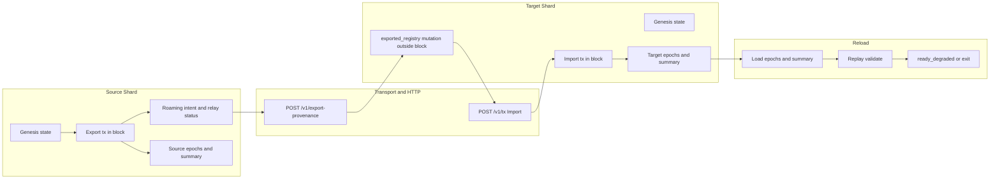

# Historical (Pre-A-D) Shard Coexistence, Persist, and Reload Review

Date: 2026-05-03

Scope: pre-A-D implementation snapshot for `pwmd` / `pwm-core` two-shard coexistence, cross-shard export/import, snapshot persistence, and reload validation. This document preserves historical analysis used to motivate stabilization slices.

## Post A-D status (current MVP baseline)

For current MVP behavior after implemented slices A-D (`61fa3d4`, `1270b06`, `d56a699`, `669a41a`), runtime contract is:

- Deterministic target path is `Import` with embedded provenance.
- `POST /v1/export-provenance` (`handoff_register`) is transport/pending material and does not mutate replay-critical `State.exported_registry`.
- Automatic trust-gated backfill is available for cleanup/rollback recovery and is idempotent by import/export facts.
- Offline repair contract is provided by `pwmd-snap-repair` (backup-first, validate-after-write).
- Dedicated settlement/import-export chain remains a future-stage architecture option, not an MVP gate.

## Historical pre-A-D analysis (kept for context)

Everything from this section onward describes pre-A-D behavior and should not be read as current runtime truth.

## Short Verdict (pre-A-D)

The current cross-shard path is not purely block-replay deterministic.

`Export` and `Import` are block transactions, but the target-side provenance registration (`handoff_register`) mutates `State.exported_registry` outside a block. That state is part of `digest(State)` and therefore participates in future `state_root` values. Snapshot replay compensates by seeding missing import provenance from `snapshot.state.exported_registry`, which makes reload correctness depend on side-state being exactly aligned with the block history.

This is the likely class of failure behind:

```text
snapshot chain mismatch: block[...] height ... state_root does not match replayed state
```

## Flow Overview



## 1. Main Node Startup With Genesis

Startup builds an in-memory `Chain` from the configured genesis source:

- `GenesisSource::DevNet`, or
- `GenesisSource::JsonFile` via `load_genesis_bundle`.

The initial chain has height `0`, no blocks, and `State` from `cfg.state0()`. The app also starts with empty operational side-state:

- `RoamingPool`
- `CrossShardLedger`
- peer account views
- flow trace

The genesis state and validator set are critical. If the node that reads persisted blocks uses a different genesis config or different consensus constants than the writer, replay will produce different roots even if the files are not corrupted.

Relevant code:

- `crates/pwmd/src/bootstrap.rs`
- `crates/pwm-core/src/chain.rs`

## 2. Second Node Startup and Genesis Relationship

The second shard is a separate node and a separate chain. It must use compatible genesis parameters and validator keys, but it has its own runtime identity:

- shard id
- network id
- cluster domain high byte
- cluster id
- node id

The two chains do not need equal heights. In normal operation, source and target heights may differ by thousands of blocks. What must match is the logical cross-shard data:

- `export_id`
- source and target domains
- sender/recipient accounts
- amount
- provenance fields needed by target import validation

For MVP, this means "same cross-shard operation" does not mean "same block height". It means both chains contain compatible facts about the same export/import lifecycle.

Relevant code:

- `crates/pwmd/src/identity.rs`
- `crates/pwmd/src/bootstrap.rs`
- `crates/pwmd/src/handshake.rs`

## 3. Empty Block Accumulation

During normal idle time, the seal loop continues producing blocks. Even empty blocks change chain state because block sealing still applies:

- mark accrual
- producer reward
- new block header
- new `state_root`

So thousands of "empty" blocks are not no-ops. They form a real chain history.

For JsonFile epoch persistence:

- each sealed block is appended into `epochs/block_e*.json`;
- one epoch file spans `1000` heights;
- `pwm-epochs-manifest.json` tracks `canonical_h`, `tip_hash`, and epoch metadata;
- every `100` blocks, `pwm-data.json` checkpoint summary is rewritten.

`pwm-data.json` in epoch mode stores:

- snapshot version
- genesis rows
- current `State`
- `roaming`
- `cross_shard`
- `blocks_stored = "epochs"`
- `checkpoint_height`

It normally omits full block bodies; block bodies live in epoch files.

Relevant code:

- `crates/pwmd/src/lifecycle.rs`
- `crates/pwmd/src/snapshot/epoch.rs`
- `crates/pwmd/src/snapshot/incremental.rs`
- `crates/pwmd/src/snapshot/io.rs`
- `crates/pwm-core/src/chain.rs`

## 4. Cross-Shard Transaction Processing

### Source Shard

On source, `Export` is a normal block transaction.

When sealed, `TxBody::Export` is applied through the chain state transition. It changes source `State` and records export provenance in `State.exported_registry`.

Additional non-root operational data is also updated:

- `RoamingPool` tracks intent lifecycle.
- `CrossShardLedger` records export facts for observability.
- flow trace records recent events.

`RoamingPool` and `CrossShardLedger` are persisted in snapshot, but they are not part of `digest(State)`. They should be treated as operational state, not the source of chain truth.

### Handoff / Provenance Delivery

Current target-side handoff uses HTTP:

```text
POST /v1/export-provenance
```

The handler inserts provenance directly into target `chain.st.exported_registry`, records cross-shard ledger data, pushes flow trace, and saves a snapshot.

Important: this target-side provenance registration is not currently represented as a block transaction. It mutates replay-critical `State` outside `Chain::seal`.

Relevant code:

- `crates/pwmd/src/api/handlers_roaming.rs`

### Target Shard

On target, `Import` is a normal block transaction if and when it enters the mempool and is sealed.

The import validation depends on target `State.exported_registry` containing the matching export provenance. If present, `TxBody::Import` updates target balances and `imported_set`.

This means the target chain root for the import block depends on provenance that may have arrived before the block through a side-channel, not through a previous block.

### What Each Blockchain Stores

Current implementation:

- source chain stores `Export` in a block;
- target chain stores `Import` in a block;
- target provenance needed by `Import` may be stored only as side-state via `handoff_register`;
- source/target roaming and cross-shard status are persisted as application state, not as chain transactions.

Therefore, the current implementation does not yet satisfy the strict interpretation: "both shards save all export/import facts as replayable blockchain transactions." It saves the main export/import actions as txs, but some necessary target-side provenance can live outside block history.

## 5. Node Shutdown and Final State Persistence

A consistent stopped node needs these artifacts to agree:

- epoch JSONL files contain the canonical block bodies up to manifest tip;
- `pwm-epochs-manifest.json` points to the same tip height and tip hash;
- `pwm-data.json` contains a `State` whose digest matches the current tip block's `state_root`;
- `checkpoint_height` agrees with the manifest canonical height when epoch mode is used;
- `roaming` and `cross_shard` reflect the application-level lifecycle at the same moment.

The dangerous state is a snapshot summary that includes a `State` mutation not represented in the block history expected by replay. For example: target `exported_registry` is changed by handoff, snapshot is saved, but block headers around that moment were produced from a different view of state or replay reconstructs it at a different moment.

## 6. Reload and Target Degradation

On reload, JsonFile loading performs these steps:

1. Read `pwm-data.json` summary if present.
2. Read epoch files or only tail blocks depending on verification mode.
3. Validate genesis rows and chain structure.
4. Validate block headers, signatures, tx roots, producer index.
5. Recompute state by replay when full verification is enabled.
6. Compare replayed `digest(State)` to each block header's `state_root`.
7. Convert snapshot into runtime state.

In full replay validation, `validate_snapshot` resets replay state to genesis and applies each block. For `TxBody::Import`, if replay state does not already have the required `exported_registry` row, the loader seeds it from `snapshot.state.exported_registry`.

This is the current compatibility hook for target import replay. It is also the fragile part: if `snapshot.state.exported_registry` is missing, has extra rows, or is applied at a different logical moment than when the block was originally sealed, replayed roots can diverge.

Relevant code:

- `crates/pwmd/src/snapshot/io.rs`
- `crates/pwmd/src/snapshot/types.rs`
- `crates/pwmd/src/lifecycle.rs`

## Observed Mismatch Hypothesis

The repeated pattern "works until cross-shard, target degrades after reload" points to replay-critical side-state drift on the target shard.

Most likely classes:

1. Target `State.exported_registry` is mutated by handoff outside a block.
2. Snapshot summary and epoch block history describe slightly different moments.
3. Replay reconstructs target state from genesis + blocks + lazy provenance injection, but not at exactly the same state transition point as the original seal.
4. The recomputed `digest(State)` differs from the block header `state_root`.

Other possible contributors:

- writer and reader use different genesis parameters or binary rules;
- epoch manifest, summary, and JSONL files are not atomically aligned;
- a failed snapshot save or rollback path leaves app state and persisted state describing different heights.

## Fragile Points Checked

### Peer Handshake and Genesis Guard

The peer handshake does reject incompatible peers by network/genesis identity.

Current behavior:

- local hello carries `network_id`, `genesis_hash`, domain identity, node id, nonce, timestamp, signature, and optional tip height;
- inbound validation rejects `network_id` mismatch;
- inbound validation rejects `genesis_hash` mismatch when an expected hash is configured;
- outbound dialing first checks peer `/v1/status` and rejects a seed whose `effective_genesis_hash` differs;
- mismatch updates `genesis_guard` so `/v1/status` can expose the blocked state.

Important nuance: the second node does not currently "import a genesis block" from the first node. It starts from its own configured genesis source and only verifies that the peer reports the same effective genesis hash. There is a safe stub message for parent genesis fetch, but no silent remote genesis replacement.

Relevant code:

- `crates/pwmd/src/handshake.rs`
- `crates/pwmd/src/transport/dial.rs`
- `crates/pwmd/src/transport/incoming_hello.rs`
- `crates/pwmd/src/api/handlers_peer.rs`
- `crates/pwmd/src/api/handlers_status.rs`
- `crates/pwmd/src/relay.rs`

### After Manual Chain Cleanup

Current implementation does not provide a real historical sync/backfill protocol.

If a node's local blockchain is manually cleaned, peer connection alone does not make it scan the peer's blocks and import all export/import transactions that affect its shard. The code has relay for live/current operations and advertises a `"sync"` capability string in `NodeHello`, but there is no block-sync endpoint or "catch up affected cross-shard txs" worker in the current HTTP router.

What does work today:

- if a valid `Import` tx is submitted to the correct target shard via `/v1/tx`, it can be sealed into the nearest block;
- if the import targets a foreign shard, the source node can relay it to a configured peer;
- if target provenance is re-submitted through `/v1/export-provenance`, the current target can accept it idempotently when it matches existing data.

What is not implemented:

- automatic historical scan of a peer chain after reconnect;
- automatic reconstruction of target provenance from source export blocks;
- automatic re-import of old export/import transactions after local chain cleanup;
- remote genesis fetch/replace.

For MVP recovery, this means a cleaned node needs either manual re-submission of the handoff/import material, or a new explicit backfill command/protocol.

Manual re-submission is not a safe long-term recovery contract. It can leave the federation in a partially invalidated state: source has already burned/locked/exported funds, while target has not credited the recipient. If the recipient later receives an internal transfer or another successful import, operators can observe a "parallel balance history" problem where two plausible worlds exist: one with the missing import and one without it.

Therefore, MVP recovery should prefer automatic reimport/backfill:

- discover cross-shard exports/imports that affect the local shard;
- verify them against trusted peers and genesis/network identity;
- replay or re-submit missing target-side provenance/import material into the next valid local block;
- make the recovery action visible in chain history, not only in side-state;
- validate after recovery that `state_root` replay succeeds.

Manual operations should be limited to backup, offline repair, diagnostics, and explicit operator confirmation when automatic proof is unavailable.

### Future Option: Dedicated Cross-Shard Settlement Chain

A stricter next-stage architecture is a separate import/export settlement chain. In that model, all shards follow one shared consensus stream for cross-shard facts:

- source export is recorded in the settlement chain;
- target import consumes a settlement-chain fact;
- all nodes verify the same cross-shard ordering and finality;
- local shard chains no longer need ad-hoc side-channel provenance.

This is heavier than the immediate MVP fix, but it matches the long-term requirement that cross-shard money movement must have one globally agreed source of truth.

## Minimal Correct Rollback

If the first bad block is height `5080`, the minimal rollback target is `5079`.

But a safe rollback is not just deleting the block line. It must:

1. replay to height `5079`;
2. derive the exact `State` at `5079`;
3. truncate epoch JSONL files after `5079`;
4. update `pwm-epochs-manifest.json`:
   - `canonical_h = 5079`;
   - `tip_hash = hdr_hash(block 5079)`;
   - epoch metadata `last_h = 5079` for the containing epoch;
5. rewrite `pwm-data.json` checkpoint summary with `checkpoint_height = 5079`;
6. validate reload after the repair.

If replay also fails before `5079`, rollback must move lower to the last reproducible height.

## MVP Stabilization Rules

1. Every mutation that affects `digest(State)` must be replayable from genesis and blocks.
2. `Export` and `Import` must remain block transactions.
3. Target provenance needed for `Import` must either be a block-level fact or have a deterministic replay rule that exactly matches sealing.
4. Snapshot save must not persist a `State` that is not aligned with the current canonical tip header.
5. `roaming` and `cross_shard` should remain operational metadata; they must not be required to prove `state_root`.
6. A node with unrecoverable snapshot mismatch should exit by default so orchestration restarts or alerts instead of leaving a passive daemon.
7. Repair tooling should be offline, backup-first, and validate-after-write.

## Recommended Next Step

For stable MVP while keeping cross-shard enabled, the key code decision is to make target provenance block-replay deterministic.

Two realistic directions:

1. Add provenance to the target block path: either extend `TxBody::Import` with required provenance or add a separate system/provenance tx that is sealed before/import-with the import.
2. Keep handoff as HTTP only, but forbid it from mutating replay-critical `State`; store it in non-root pending provenance, and move it into `State` only as part of the sealed import transition.

The second option is smaller for MVP: target handoff becomes "pending import material", and `State.exported_registry` is updated only when a block transaction consumes that material deterministically.

