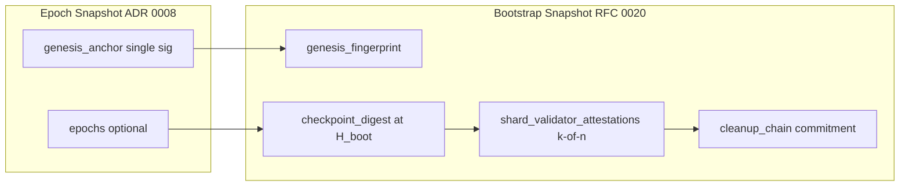

# RFC 0020: Bootstrap Snapshot и дистрибуция pruned chains

**Status:** Draft (foundation; implementation after Epoch Snapshot genesis anchor, ADR 0008)  
**Version:** 0.1  
**Depends on:** ADR 0004, ADR 0008, [RFC 0005](5-genesis-and-bootstrap.md), [guide-node-storage-and-snapshot.md](../guide-node-storage-and-snapshot.md)

---

## 1. Abstract

PWM разделяет **Epoch Snapshot** (операционный checkpoint на диске узла) и **Bootstrap Snapshot** (архивный, кворумно утверждённый пакет для bootstrap новых нод и **дистрибуции pruned chains**).

Этот RFC фиксирует, как **genesis fingerprint** и **chain origin** из ADR 0008 эволюционируют в Bootstrap Snapshot, и как **активные валидаторы шарда** солидарно подписывают дайджест checkpoint — реальную опору после удаления старых epoch-файлов.

---

## 2. Проблема

1. **Epoch Snapshot trust-default** не доказывает происхождение всей истории (см. ADR 0008 — лёгкий preflight).
2. После **pruning** block@1 и средние epoch могут отсутствовать на диске; новая нода не может «дойти» до tip только по tail.
3. Нужен **переносимый артефакт**, которому доверяют все shard validators, а не один локальный файл и не одна fool-guard подпись.

---

## 3. Термины (не смешивать)

| Термин | Роль |
|--------|------|
| **Epoch Snapshot** | `pwm-data.json` + `epochs/`; autosnapshot; trust-default на своём диске |
| **Genesis fingerprint** | Неизменяемая привязка к `GenCfg.state0()` + `gencfg_digest` + `chain_origin_hdr_hash` (block 1) |
| **Bootstrap Snapshot** | Архивный пакет на высоте `H_boot` с полным state + минимальным policy-origin + кворумом подписей |
| **ArchiveCommitment** | Запись в **cleanup-chain**: hash bootstrap + ссылка на prev commitment |
| **Pruned distribution** | Выдача новому узлу: Bootstrap Snapshot (+ опционально tail epochs), без полной истории |

---

## 4. Связь с ADR 0008 (Epoch layer)

ADR 0008 вводит в Epoch Snapshot wire:

```text
genesis_anchor.schema_v = 1
  genesis_state_root
  gencfg_digest
  block1_hdr_hash
  signer_prod_idx + signature   # одна подпись, fool-guard
```

**Требование совместимости (normative intent):**

- Поля `genesis_state_root` и `gencfg_digest` в Bootstrap Snapshot MUST совпадать с алгоритмом ADR 0008 (один код path в `pwmd`).
- `block1_hdr_hash` в Bootstrap переименуется концептуально в **`chain_origin_hdr_hash`** (то же значение, тот же preimage block height=1).
- При публикации Bootstrap из epoch-узла: если epoch snapshot не содержит anchor или preflight fail — Bootstrap MUST NOT публиковаться.



---

## 5. Bootstrap Snapshot — структура (черновик wire)

```json
{
  "schema_v": 1,
  "shard_id": { "network_id": "...", "domain_hi": "0x2C", "cluster_id": "..." },
  "boot_height": 120000,
  "genesis_fingerprint": {
    "genesis_state_root": "<hex32>",
    "gencfg_digest": "<hex32>",
    "chain_origin_hdr_hash": "<hex32>"
  },
  "checkpoint_digest": {
    "tip_height": 120000,
    "tip_hdr_hash": "<hex32>",
    "state_root": "<hex32>",
    "epoch_manifest_hash": "<hex32 optional>"
  },
  "state_bundle": { "...": "compressed state + rolled_policy_origin_set per ADR 0004" },
  "shard_validator_attestations": [
    {
      "member_instance_id": "cy-quorum-proposer",
      "validator_prod_idx": 0,
      "signature": "<hex64>"
    }
  ],
  "quorum": { "k": 1, "n": 2 },
  "prev_cleanup_commitment": "<hex32 or zero>"
}
```

### 5.1 `bootstrap_preimage` (подпись кворума)

Стабильный blake3 domain-separated blob (порядок полей фиксирован):

```text
PWMv0/BOOTSNAP/v1
|| genesis_state_root (32)
|| gencfg_digest (32)
|| chain_origin_hdr_hash (32)
|| tip_height (le u64)
|| tip_hdr_hash (32)
|| state_root (32)
|| boot_height (le u64)   # MUST equal tip_height for full bootstrap at tip
|| prev_cleanup_commitment (32)
```

Каждый **активный** validator шарда (member в `cluster_members` / genesis validator set на `boot_height`) MAY добавить запись в `shard_validator_attestations`.

**Проверка при load:**

- `count(valid signatures) >= quorum.k`;
- каждый `validator_prod_idx` ∈ текущего validator set на `boot_height`;
- `genesis_fingerprint` совпадает с `--genesis-file`;
- `chain_origin_hdr_hash` совпадает с block@1, если block@1 включён в пакет, иначе — доверие к кворуму + cleanup-chain (pruned path).

### 5.2 Отличие от ADR 0008

| | Epoch `genesis_anchor` | Bootstrap attestations |
|--|------------------------|-------------------------|
| Цель | Локальный fool-guard | Сеть / shard solidarity |
| Подписи | 1 | k-of-n активных validators |
| Высота | Любой checkpoint | Фиксированный `boot_height` |
| Prune | Требует block@1 на диске | Несёт state bundle; block@1 не обязан быть на целевом диске |

---

## 6. Cleanup-chain и pruned distribution

### 6.1 Публикация

Триггер (policy TBD, ориентир):

- каждые `N` блоков после audit window;
- или перед prune диапазона `[0 .. H_prune_max]`.

Шаги proposer shard:

1. Сформировать Bootstrap Snapshot на `H_boot`.
2. Собрать k-of-n подписей (cluster attest path или offline cosign ceremony).
3. Записать `ArchiveCommitment`:

```text
commitment_hash = blake3(PWMv0/CLEANUP/v1 || bootstrap_snapshot_hash || prev_commitment_hash)
```

4. Разрешить prune только если `commitment` известен всем live validators (gossip / object store / static mirror).

### 6.2 Дистрибуция новой ноде (pruned path)

```text
1. Download Bootstrap Snapshot (manifest + state_bundle) for shard_id
2. Verify quorum signatures on bootstrap_preimage
3. Verify genesis_fingerprint vs local --genesis-file
4. Load state_bundle into node; set tip = boot_height
5. Optional: sync tail blocks H_boot+1 .. live_tip via P2P
6. Reject if cleanup-chain head on network != prev_cleanup_commitment in package (fork detection)
```

**Без** полного epoch replay. Audit path: full replay или archive node с полными epoch files.

### 6.3 Что обязано остаться в архиве

Минимум для forensic / dispute:

- последний Bootstrap Snapshot + cleanup-chain head;
- `chain_origin_hdr_hash` и genesis file (public);
- опционально: block@1 body в bootstrap package (малый размер) — рекомендуется для self-contained distribution.

---

## 7. Multi-shard и «солидарность шардов»

- Bootstrap Snapshot **per shard** (`domain_hi` / shard row key — см. `runbook-store-snapshots.md`).
- Cross-shard balances: `state_bundle` включает `cross_shard` ledger snapshot (уже в epoch wire).
- **Солидарность:** только validators, назначенные на этот shard/cluster, подписывают `bootstrap_preimage` для этого `shard_id`; чужой shard не подписывает чужой пакет.
- Global network identity: `network_id` + `gencfg_digest` должны совпадать на всех шардах одной сети (иначе genesis fork между шардами).

---

## 8. External anchoring (опционально)

По ADR 0004: редкий notary anchor (BTC/ETH) на `commitment_hash`, ссылающийся на **prev** anchor той же cleanup-chain — не замена k-of-n.

---

## 9. Реализация — фазы

| Фаза | Содержание | Зависимость |
|------|------------|-------------|
| **P0** | ADR 0008 epoch `genesis_anchor` + block@1 preflight | Тикет `20260612-v5-snapshot-genesis-anchor-light-coding` |
| **P1** | Стабильный `gencfg_digest()` в `pwm-core`; тест vector | P0 |
| **P2** | Bootstrap wire schema + verify-only loader (feature flag) | P1 + ADR 0004 policy-origin fields |
| **P3** | k-of-n attest на seal milestone; cleanup-chain append | cluster RFC16 |
| **P4** | Prune policy + distribution tooling | P3 + audit window policy |

**Не блокировать P0:** в ADR 0008 заложить стабильные имена/алгоритмы digest, чтобы P1 не ломал epoch snapshots.

---

## 10. Open questions

1. `quorum.k` для 2-node CY lab vs production 3-of-5 — в wire отдельное поле vs derived from genesis.
2. Включать ли block@1 целиком в bootstrap package (рекомендация: да, &lt;1 MB).
3. Связь с ClickHouse `validators_accept` — тот же preimage или отдельный CH row type.
4. Автоматическая публикация bootstrap при autosnapshot каждые 1000 blocks vs отдельная ceremony.

---

## 11. Ссылки

- [ADR 0004: Cleanup-chain, Bootstrap Snapshot](../adr/0004-cleanup-chain-bootstrap-snapshot-and-anchoring.md)
- [ADR 0008: Genesis anchor (epoch)](../adr/0008-snapshot-genesis-anchor-light.md)
- [CONCEPT_ROADMAP.md](../CONCEPT_ROADMAP.md) — § Bootstrap Snapshot, R10–R12
- [FEATURES.md](../FEATURES.md) §7–8
- `docs/runbook-store-snapshots.md`
